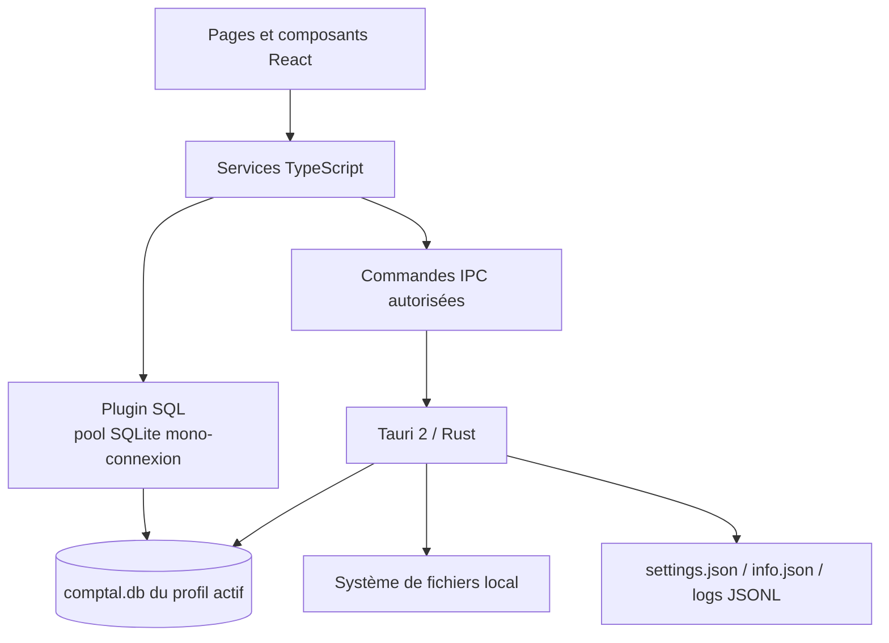
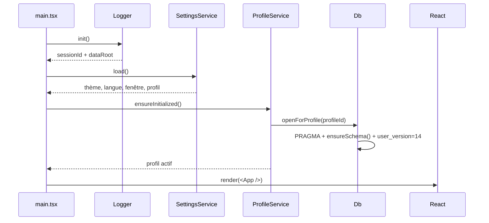

# Architecture et référence du code — Comptal2.1

## 1. Architecture d’exécution

L’application ne possède ni serveur HTTP métier, ni base distante. Vite ne sert que le renderer en
développement. Tauri héberge la WebView, expose un ensemble limité de commandes Rust et charge le
plugin SQLite.

## 2. Démarrage

Le point d’entrée `src/main.tsx` exécute `bootstrap()` avant de rendre `App`.

Même si l’initialisation échoue, le renderer est monté et l’erreur est journalisée. Les pages qui
dépendent de la base peuvent alors afficher une erreur fonctionnelle.

## 3. Routage et chargement

`src/App.tsx` utilise `HashRouter`. Dashboard, Import, Édition, Finance et Paramètres sont chargés
directement. Prévisionnel, Contacts, Facturation, Dons et Registre utilisent `React.lazy` et
`Suspense`.

`src/components/Layout/Sidebar.tsx` fournit les dix entrées. Leur visibilité est persistée dans
`AppSettings.menuVisibility`, sauf Paramètres qui reste toujours disponible.

| Route | Page | Alias |
|---|---|---|
| `#/dashboard` | Dashboard | |
| `#/upload` | Import | |
| `#/edition` | Édition | |
| `#/finance-global` | Finance globale | |
| `#/previsionnel` | Prévisionnel | `#/project-management` |
| `#/clients` | Contacts | `#/contacts` |
| `#/facturation` | Facturation | `#/invoicing` |
| `#/dons` | Dons (Association) | `#/association` |
| `#/registre` | Registre | |
| `#/parametre` | Paramètres | |

## 4. Frontières de persistance

| Donnée | Stockage | Propriétaire du cycle de vie |
|---|---|---|
| Paramètres globaux | `data/parameter/settings.json` | `SettingsService` |
| Métadonnées profil | `data/profils/{id}/info.json` | `ProfileService` |
| Données métier | `data/profils/{id}/comptal.db` | `Db` et services métier |
| Pièces jointes copiées | `data/profils/{id}/attachments/` | `AttachmentService` |
| Journaux | `data/logs/*.jsonl` | `Logger` |
| Exports/archives | Chemin choisi par l’utilisateur | services d’export + IPC Rust |

En mode debug, `src-tauri/src/paths.rs` résout `data/` à la racine du projet. En production, la
racine est le répertoire applicatif de `com.leopaul.comptal21`.

## 5. Couche SQLite

`src/services/db.ts` est le seul adaptateur direct vers `@tauri-apps/plugin-sql`.

| API | Contrat |
|---|---|
| `Db.openForProfile(profileId)` | Ferme l’ancienne connexion, ouvre le fichier du profil, active FK/WAL/timeout, répare et migre le schéma |
| `Db.close()` | Ferme la connexion et oublie le profil actif |
| `Db.select<T>(sql, params)` | Exécute un `SELECT`, type le résultat côté TS, journalise erreurs et lenteurs |
| `Db.execute(sql, params)` | Exécute une mutation et renvoie `rowsAffected`/`lastInsertId` |
| `Db.inTransaction(name, run)` | `BEGIN IMMEDIATE`, puis `COMMIT` ou `ROLLBACK` |

Le patch local `src-tauri/patches/tauri-plugin-sql` impose une seule connexion SQLite. Cette
condition est nécessaire : les appels `BEGIN`, mutations et `COMMIT` doivent utiliser la même
connexion.

`ensureSchema()` rejoue toujours les `CREATE TABLE/INDEX IF NOT EXISTS` puis ajoute les colonnes
manquantes. `PRAGMA user_version` seul n’est donc pas considéré comme une preuve que toutes les
tables existent.

## 6. Commandes Rust

Les commandes sont enregistrées dans `src-tauri/src/lib.rs` et implémentées dans
`src-tauri/src/commands.rs`.

| Groupe | Commandes | Responsabilité |
|---|---|---|
| Session | `get_session_info` | Identifiant de session, racine des données, version, mode dev |
| Fichiers relatifs | `read_text_file`, `write_text_file`, `append_text_line`, `write_binary_file` | Lire/écrire uniquement sous `dataRoot` |
| Dossiers relatifs | `read_dir`, `path_exists`, `mkdirs`, `delete_file`, `delete_dir`, `copy_dir` | Cycle de vie des profils et pièces jointes |
| Archives | `zip_dir`, `unzip_to` | Export/import de profils |
| Chemins externes | `read_external_text_file`, `write_external_text_file`, `read_external_dir`, `external_exists` | Import legacy et exports explicitement choisis |
| Résolution/ouverture | `resolve_data_path`, `open_path` | Transformer un chemin relatif sûr ou demander l’ouverture OS |

`paths::resolve()` refuse les chemins absolus et toute composante `..`. Les commandes externes sont
séparées car elles acceptent volontairement un chemin absolu sélectionné par l’utilisateur.

## 7. Référence des services

### Fondation

| Service | Fonctions principales | Effets |
|---|---|---|
| `Logger` | `init`, `debug`, `info`, `warn`, `error`, `data`, `perf` | Fichiers JSONL par session |
| `SettingsService` | `load`, `save`, `subscribe`, `current` | Paramètres globaux avec cache et notifications |
| `ProfileService` | `list`, `create`, `rename`, `remove`, `setActive`, `ensureInitialized`, `exportZip`, `importZip` | Dossiers profil, changement de DB, migration legacy |
| `ConfigService` | CRUD comptes/catégories, comptage des transactions | Tables `accounts`, `categories`, propagation des renommages |
| `MigrationService` | `analyze`, `migrate`, `migrateLegacyProfileIfNeeded` | Conversion des profils Comptal2 |
| `WindowService` | `apply` | Taille/position de la fenêtre Tauri |
| `UpdateService` | vérification, téléchargement et installation | Plugin updater Tauri |

### Transactions, import et statistiques

| Service | Fonctions principales | Tables/flux |
|---|---|---|
| `FileDetectionService` | détection CSV/XLSX, feuilles et en-têtes | Fichiers en mémoire |
| `ColumnMappingService` | mapping et validation des rôles de colonnes | Modèle `ColumnMapping` |
| `ImportTemplateService` | `list`, `create`, `update`, `remove` | `import_templates` |
| `ImportService` | `transformRows`, `findOverlaps`, `importRows` | `imports`, `transactions`, transaction SQL |
| `EditionService` | liste paginée, `getById`, `update`, `insert`, `remove`, doublons, batch catégories | `transactions` |
| `EditionUiService` | préférences de colonnes par profil | paramètres UI locaux |
| `AutoCategorisationService` | `load`, `learn`, `suggest`, `rebuild` | `autocat_stats` |
| `LabelRuleService` | `list`, `upsert`, `apply`, `match` | `label_rules` |
| `StatsService` | bornes/périodes, KPI, catégories, comptes, soldes, séries, bilan, transactions | Agrégats SQL en lecture |
| `ExportService` | export CSV | Écriture externe |

`StatsService.strftimeExpr()` traduit une granularité en expression SQLite.
`autoGranularity()` choisit une granularité selon l’amplitude de dates.

### Prévisionnel

| Module | Fonctions principales | Rôle |
|---|---|---|
| `ProjectService` | CRUD prévisions et lignes, arbre, réordonnancement | `projects`, `project_subscriptions` |
| `ForecastModel` | `treeToGridRows`, `parsePeriodicity`, `parseFlowType`, `computeForecast`, `cloneLayout` | Passage arbre ↔ grille et calcul des widgets |
| `ProjectionService` | aplatissement, occurrence à une date, projection, agrégation, statistiques | Moteur de récurrence pur |

Une ligne groupe possède `is_group=1` et ses enfants pointent vers `parent_id`. Le montant du groupe
est calculé à partir de ses descendants.

### Contacts et facturation

| Service | Fonctions principales | Tables |
|---|---|---|
| `ClientService` | charger, rechercher, créer/mettre à jour, supprimer/importer | `clients` |
| `ContactGroupService` | CRUD groupements | `contact_groups` |
| `EmetteurService` | configuration/validation société, numérotation | `invoice_emetteur`, `invoice_settings` |
| `InvoiceService` | totaux, devis/factures, caducité, pièces jointes, numéros | `devis`, `factures` |
| `PaymentTrackingService` | reste dû, statut, rapprochement montant/libellé, liaison transaction | payload `factures` + `transactions` |
| `PosteService` | catalogue et groupes de postes | `postes_catalogue`, `postes_groupes` |
| `SecteurService` | secteurs d’activité | `secteurs_activite` |
| `PDFTemplateService` | modèles PDF | `pdf_templates` |
| `LegalMentionsService` | mentions prédéfinies/personnalisées | `legal_mentions` |
| `PDFService` | génération devis/factures | pdfmake + chemin externe |
| `AttachmentService` | copie, résolution, suppression | dossier du profil |

`InvoiceService.calculateLineHT()` distingue matériel et travail.
`calculateTotals()` agrège HT, TVA par taux et TTC. Les dates sont sérialisées en ISO dans les
payloads JSON, puis réhydratées en objets `Date`.

### Association

| Service | Fonctions principales | Tables |
|---|---|---|
| `AssociationConfigService` | charger, créer et enregistrer la configuration | `association_config` |
| `DonateurService` | CRUD donateurs, association catégorie/transactions | `donateurs`, `donateur_transactions` |
| `DonsService` | CRUD dons manuels | `dons_manuels` |
| `RegistreRecusService` | numérotation, ajout et annulation | `registre_recus` |
| `AssociationPDFService` | génération de reçu fiscal | configuration, donateur et don |
| `PosteAssociationService` | catalogue associatif isolé par `kind` | tables de postes |

### Registre documentaire

| Service | Fonctions principales | Tables/flux |
|---|---|---|
| `RegisterService` | paramétrage, génération d’instantanés, éléments, liens et pièces jointes | `register_*`, factures, transactions |
| `RegisterPDFService` | génération et mise à jour des rapports PDF | pdfmake, dossier de pièces jointes du profil |

## 8. Utilitaires métier

| Fichier | Fonctions notables |
|---|---|
| `utils/amounts.ts` | `parseAmount`, `roundMoney`, `formatMoney` |
| `utils/dateFormats.ts` | formats multiples vers `Date`, ISO et affichage français |
| `utils/periodKeys.ts` | clés/labels de période, navigation de granularité, filtrage |
| `utils/invoiceFormat.ts` | identifiants, heures `hh:mm`, dates, libellés contacts, détection de numéro |
| `utils/editionHistory.ts` | construction des actions annuler/refaire |
| `utils/financeColorStyle.ts` | couleur sémantique selon le signe |

## 9. Règles de modification

1. Toute évolution de table doit être ajoutée à `ensureSchema()` et augmenter `SCHEMA_VERSION`.
2. Les données JSON doivent être compatibles avec les fonctions `revive`/`deserialize` du service.
3. Toute transaction multi-requête passe par `Db.inTransaction`.
4. Les chemins sous `data/` passent par `tauriBridge`; les chemins externes nécessitent une action
   explicite de l’utilisateur.
5. Une évolution Rust exige un redémarrage Tauri complet ; le HMR Vite ne recharge que le renderer.

Pour les helpers `jsonStore`, le patch SQLite, les préférences Édition, SIRENE et l’enregistrement
Chart.js, voir [Services transverses et infrastructure](./services-transverses.md). Les invariants de
données sont centralisés dans [Conventions métier](./conventions-metier.md).
