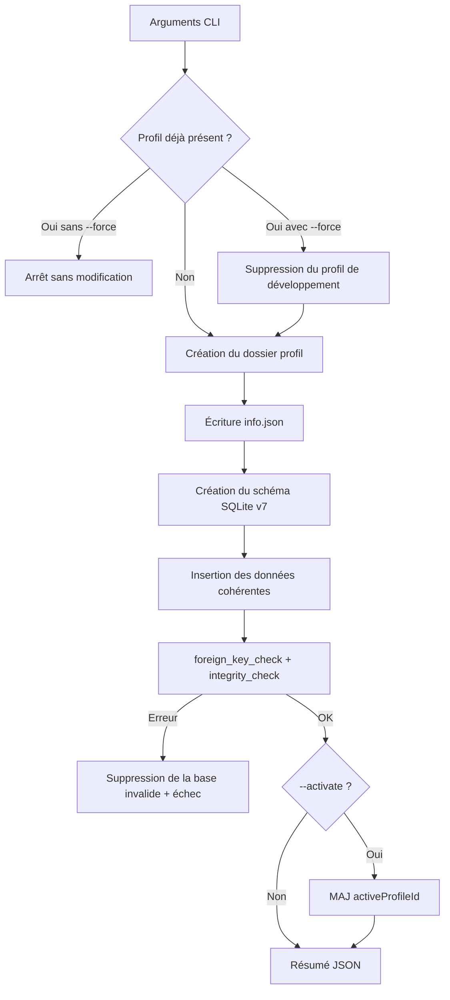

# Base de données de développement

## Objectif

`scripts/create-dev-database.py` crée un profil local reproductible sans utiliser l’interface. Les
données sont fictives et couvrent les principaux écrans. Le profil est écrit sous
`data/profils/profile_developpement/`, dossier ignoré par Git.

Le générateur utilise uniquement Python 3 et sa bibliothèque standard `sqlite3`. Il ne dépend pas
d’un serveur, d’un paquet npm supplémentaire ni d’une base utilisateur existante.

## Création

Depuis `Comptal2.1/` :

```bash
npm run db:dev
```

Pour recréer la base à l’identique :

```bash
npm run db:dev -- --force
```

Pour la créer et la sélectionner au prochain démarrage :

```bash
npm run db:dev -- --force --activate
```

L’option `--activate` modifie uniquement `data/parameter/settings.json`. Si l’application tourne
déjà, il faut la redémarrer ou sélectionner le profil depuis Paramètres > Profils.

Un profil isolé peut être produit avec :

```bash
python3 scripts/create-dev-database.py \
  --profile-id profile_scenario_facturation \
  --profile-name "Scénario facturation"
```

Sans `--force`, le script refuse d’écraser un profil existant. Même avec `--force`, il refuse de
supprimer un profil dont `info.json` ne porte pas le marqueur `developmentDatabase: true`.

## Contenu fonctionnel

| Domaine | Jeu de données |
|---|---|
| Comptes | Compte courant, épargne et carte |
| Catégories | Revenus, charges, dons, transferts `Y`, exclusion `X` |
| Import | Deux historiques d’import et un modèle avec rôle `debitCredit` |
| Édition | Transactions de janvier à septembre 2026, dont une non catégorisée |
| Dashboard/Finance | Débits, crédits, transferts, plusieurs comptes et périodes |
| Auto-catégorisation | Statistiques de mots usuels |
| Prévisionnel | Prévision 2027, groupe de charges et lignes récurrentes |
| Contacts | Une entreprise, un particulier et un groupement |
| Facturation | Catalogue, devis accepté, facture payée et transaction liée |
| Organisation/PDF | Émetteur de test, réglages et mention légale |
| Association | Configuration, deux donateurs, dons liés/manuels et deux reçus |

Les adresses, identifiants, courriels et coordonnées sont fictifs. Les numéros SIREN/SIRET servent
uniquement à franchir les validations locales ; ils ne représentent pas l’identité de l’utilisateur.

## Processus de génération



## Contrôles intégrés

Avant d’annoncer un succès, le script vérifie :

- `PRAGMA integrity_check = 'ok'` ;
- aucune ligne retournée par `PRAGMA foreign_key_check` ;
- `PRAGMA user_version = 7` ;
- les volumes des tables principales.

Contrôle manuel complémentaire :

```bash
python3 - <<'PY'
import sqlite3
db = sqlite3.connect("data/profils/profile_developpement/comptal.db")
print(db.execute("PRAGMA integrity_check").fetchone()[0])
print(db.execute("PRAGMA user_version").fetchone()[0])
print(db.execute("SELECT COUNT(*) FROM transactions").fetchone()[0])
db.close()
PY
```

## Limites et maintenance

- Le fichier généré n’est pas versionné ; le script est la source de vérité.
- Le schéma du générateur doit rester aligné sur `src/services/db.ts`.
- Après une migration, mettre à jour `SCHEMA_SQL`, le `user_version`, les données concernées et ce
  document dans le même changement.
- Le script ne doit jamais cibler un identifiant de profil utilisateur avec `--force`.
- Les pièces jointes et PDF ne sont pas générés : seules leurs données métier sont couvertes.
