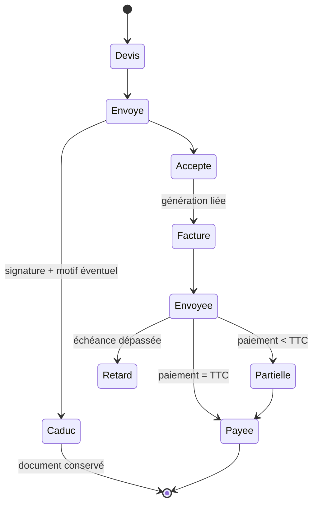
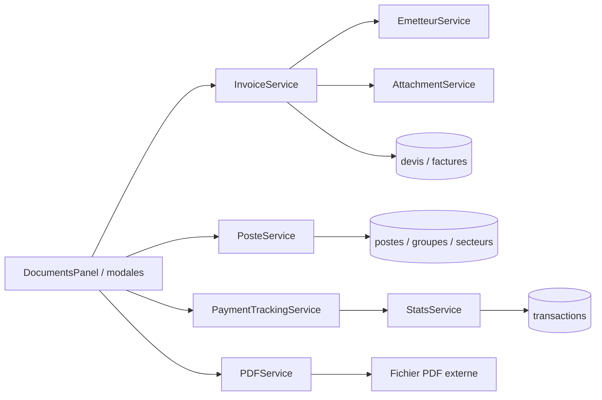
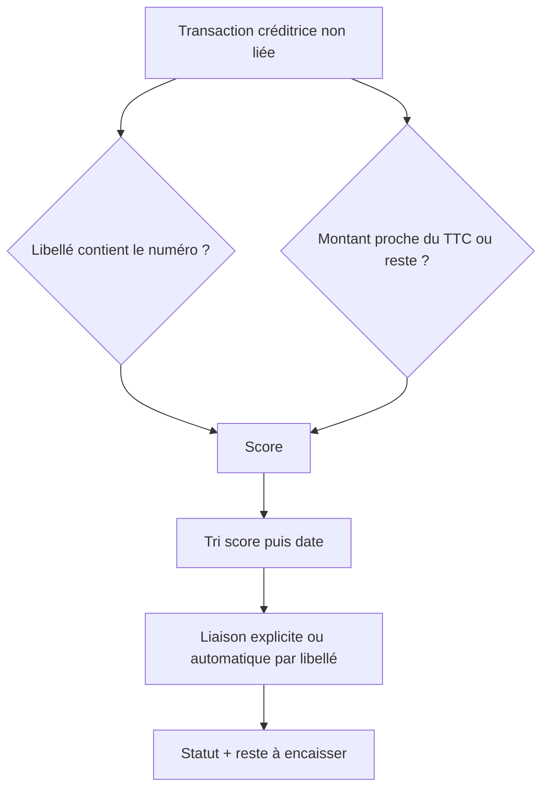

# Carte — Facturation

## Flux documentaire



## Dépendances



## Calcul d’un paiement proposé



## Arborescence des fonctions

```
Facturation.tsx
├── setTab('docs' | 'postes')
├── DocumentsPanel
│   ├── reload → ClientService.loadBillingClients, InvoiceService.loadDevis/loadFactures, StatsService.listAllTransactions
│   ├── openPdf → PDFService + AttachmentService
│   ├── DevisModal / FactureModal → DocumentEditor
│   │   ├── InvoiceService.calculateTotals / peekNextNumero / generateNumero / upsertDevis / upsertFacture
│   │   └── PosteService.loadPostes
│   ├── GestionDevisRow / GestionFactureRow
│   ├── PaiementFactureModal → PaymentTrackingService
│   └── CaducDevisModal → InvoiceService.markDevisCaduc
└── PostesPanel kind="facturation"
    └── PosteService.loadPostes / savePostes / loadPostesGroupes / savePosteGroupe
```

