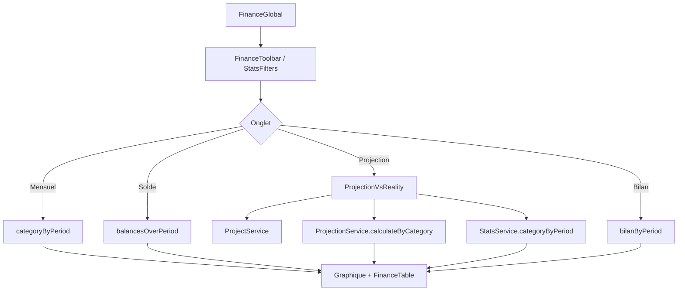

# Carte — Page Finance globale

> Référence rapide : fonctions, services et composants propres à la page Finance.

---

## Identité

| Champ | Valeur |
|-------|--------|
| Route | `/finance-global` |
| Fichier page | `src/pages/FinanceGlobal/FinanceGlobal.tsx` |
| Onglets | `monthly` \| `balance` \| `projection` \| `bilan` \| `facturation` \| `dons` \| `contacts` |

---

## Services utilisés (page principale)

### ConfigService
| Méthode | Usage |
|---------|-------|
| `listAccounts()` | Référentiel + filtres |
| `listCategories()` | Référentiel + filtres (hors `X`) |

### StatsService
| Méthode | Usage |
|---------|-------|
| `dateBounds()` | Plage dates initiale |
| `distinctPeriods()` | Options date-à-date/semaine/mois/année |
| `kpis({ excludeCategories: ['X'] })` | Détection données vides |
| `categoryByPeriod(filters, granularity)` | Onglet Mensuel + réalité Projection |
| `balancesOverPeriod(start, end, gran, accountIds)` | Onglet Solde |
| `categorySummaries(filters)` | Récap catégories |
| `accountSummaries(filters)` | Récap comptes |
| `bilanByPeriod(filters, granularity)` | Onglet Bilan (chargement différé) |
| `autoGranularity(start, end)` | Granularité par défaut |

### FinanceSettingsService / DashboardInsightsService
| Méthode | Usage |
|---------|-------|
| `FinanceSettingsService.load` / `save` | Visibilité et ordre des onglets |
| `DashboardInsightsService.load` | Onglets Facturation, Dons, Contacts |

### Logger
| Méthode | Usage |
|---------|-------|
| `Logger.error('Finance.meta', ...)` | Erreurs chargement |

---

## Services utilisés (ProjectionVsReality)

**Fichier** : `src/components/FinanceGlobal/ProjectionVsReality.tsx`

### ProjectService
| Méthode | Usage |
|---------|-------|
| `list()` | Liste projets |
| `create(input)` | Création projet rapide |
| `listSubscriptions(projectId)` | Abonnements du projet |

### ProjectionService
| Méthode | Usage |
|---------|-------|
| `calculateByCategory(project, subs, granularity, rangeStart, rangeEnd)` | Points projetés par catégorie |

---

## Types importés

| Type | Source | Rôle |
|------|--------|------|
| `Account`, `Category` | `types/models.ts` | Référentiels |
| `ChartGranularity` | `types/projection.ts` | Granularité graphique |
| `StatsFilters` | `StatsService` | Filtres SQL |
| `PeriodPoint` | `StatsService` | Point temporel |
| `AccountSummary`, `CategorySummary` | `StatsService` | Récapitulatifs |
| `BilanChartData` | `StatsService` | Données bilan |
| `FinanceTab` | `ChartTabs` | ID onglet actif |

---

## Composants enfants

| Composant | Onglet(s) |
|-----------|-----------|
| `ChartTabs` | Navigation 4 onglets |
| `FinanceToolbar` | Sidebar droite : granularité, comptes, catégories et période |
| `MonthlyChart` | Mensuel |
| `BalanceChart` | Solde |
| `ProjectionVsReality` | Projection |
| `ProjectionVsRealityChart` | Projection |
| `BilanTab` | Bilan |
| `BilanCharts` | Bilan |
| `FinanceTable` | Tous (tableau données) |

---

## Fonctions internes de la page

| Fonction | Rôle |
|----------|------|
| `buildFilters()` | Construit `StatsFilters` depuis sélections UI |
| `buildFilters()` | Construit `StatsFilters` depuis les sélections |
| `loadMain()` | Charge Mensuel, Solde et synthèses en parallèle |
| Effet `tab === 'projection'` | Charge la réalité sans borner la période projet |
| Effet `tab === 'bilan'` | Charge le bilan à la demande |

---

## Utils utilisés

| Util | Fonction |
|------|----------|
| `dateFormats.toIsoDate` | Dates ISO |
| `periodKeys.getPeriodLabel` | Labels périodes |
| `periodKeys.sortPeriodKeys` | Tri chronologique |
| `financeColorStyle` | Couleurs graphiques |

---

## Tables SQLite lues

| Table | Usage |
|-------|-------|
| `transactions` | Agrégats tous onglets |
| `accounts` | Filtres, couleurs, soldes |
| `categories` | Filtres, couleurs |
| `projects` | Onglet Projection |
| `project_subscriptions` | Calcul projection |

---

## Schéma d'appel par onglet

---

## Fichiers CSS associés

- `src/styles/finance-global-custom.css`
