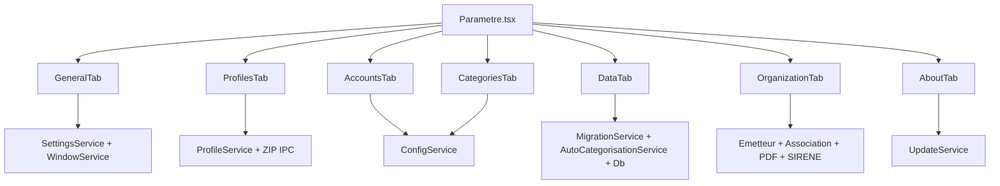

# Carte — Page Paramètres

> Référence rapide : fonctions, services et composants propres à la page Paramètres et ses 7 onglets.

---

## Identité

| Champ | Valeur |
|-------|--------|
| Route | `/parametre` |
| Fichier page | `src/pages/Parametre/Parametre.tsx` |
| Onglets | `general` \| `profiles` \| `accounts` \| `categories` \| `data` \| `organization` \| `about` |

---

## Mécanisme page parent

| Élément | Rôle |
|---------|------|
| `activeTab` | Onglet affiché |
| `profileEpoch` | Force remontage onglets data-bound après changement profil |
| `onProfileChanged` | Callback passé à `ProfilesTab` |

---

## Onglet Général (`GeneralTab.tsx`)

### Services
| Service | Méthodes |
|---------|----------|
| `SettingsService` | `current`, `save(partial)`, `subscribe()` |
| `WindowService` | `apply(settings.window)` |

### Actions
| Action | Effet |
|--------|-------|
| Changer langue | `SettingsService.save({ language })` + `i18n.changeLanguage()` |
| Changer thème | `save({ theme })` + `applyThemeToDocument()` |
| Changer zoom | `save({ zoom })` |
| Changer fenêtre | `save({ window })` + `WindowService.apply()` |
| Visibilité menus | `save({ menuVisibility })` |

### Fichiers écrits
- `data/parameter/settings.json`

---

## Onglet Profils (`ProfilesTab.tsx`)

### Services
| Service | Méthodes |
|---------|----------|
| `ProfileService` | `list`, `create`, `rename`, `remove`, `setActive`, `exportZip`, `importZip` |
| `SettingsService` | `current.activeProfileId` |

### Commandes Tauri (via dialog + tauriBridge)
| Action | Commande / API |
|--------|----------------|
| Export ZIP | `save()` dialog → `ProfileService.exportZip()` → `zip_dir` |
| Import ZIP | `open()` dialog → `ProfileService.importZip()` → `unzip_to` |

### Fichiers touchés
- `data/profils/{id}/info.json`
- `data/profils/{id}/comptal.db`
- `data/parameter/settings.json` (activeProfileId)

---

## Onglet Comptes (`AccountsTab.tsx`)

### Services
| Service | Méthodes |
|---------|----------|
| `ConfigService` | `listAccounts`, `createAccount`, `updateAccount`, `deleteAccount`, `countTransactionsForAccount` |

### Table SQLite
- `accounts` — CRUD complet

---

## Onglet Catégories (`CategoriesTab.tsx`)

### Services
| Service | Méthodes |
|---------|----------|
| `ConfigService` | `listCategories`, `createCategory`, `updateCategory`, `deleteCategory` |

### Table SQLite
- `categories` — CRUD complet
- `transactions.category_code` — mis à jour si renommage code

---

## Onglet Données (`DataTab.tsx`)

### Services
| Service | Méthodes / actions |
|---------|-------------------|
| `tauriBridge` | `openPath(dataRoot)` |
| `MigrationService` | `analyze(sourceAbs)`, `migrate(source, onProgress)` |
| `AutoCategorisationService` | `rebuildFromTransactions()` |
| `Db` | `execute('DELETE FROM …')` |

### Commandes Tauri
| Action | API |
|--------|-----|
| Ouvrir dossier data | `open_path` |
| Sélection dossier migration | `dialog.open({ directory: true })` |
| Lecture fichiers Comptal2 | `read_external_*` (via MigrationService) |

### Tables SQLite affectées
| Action | Tables |
|--------|--------|
| Migration Comptal2 | `accounts`, `categories`, `transactions`, `imports` |
| Vider transactions | `transactions`, `imports` |
| Reconstruire auto-cat | `autocat_stats` (recalcul) |
| Vider auto-cat | `autocat_stats` (DELETE) |

---

## Onglet À propos (`AboutTab.tsx`)

### Services
| Service | Méthodes |
|---------|----------|
| `UpdateService` | `checkForUpdate()`, `downloadInstallAndRelaunch(update, onProgress)` |
| `Logger` | `session.appVersion` |

### Plugins Tauri
- `tauri-plugin-updater` — vérification GitHub Releases
- `tauri-plugin-process` — relance après mise à jour

---

## Onglet Organisation (`OrganizationTab.tsx`)

| ID | Sous-onglet | Composant | Services |
|---|---|---|---|
| `company` | Identité société | `IdentityCompanyPanel` | `EmetteurService`, `SireneAPIService` |
| `pdfInvoices` | PDF factures | `PdfDocumentsPanel mode="invoices"` | `PDFTemplateService`, `LegalMentionsService` |
| `association` | Identité association | `IdentityAssociationPanel` | `AssociationConfigService` |
| `pdfReceipts` | PDF reçus | `PdfDocumentsPanel mode="receipts"` | Modèles et aperçu PDF |
| `registers` | Registres | `RegisterSettingsPanel` | `RegisterService`, `RegisterPDFService` |

Données stockées dans la base du profil : émetteur, paramètres de numérotation, configuration
association, modèles PDF et mentions légales.

---

## Composants par onglet

| Onglet | Composant | Fichier |
|--------|-----------|---------|
| Général | `GeneralTab` | `components/Parametre/GeneralTab.tsx` |
| Profils | `ProfilesTab` | `components/Parametre/ProfilesTab.tsx` |
| Comptes | `AccountsTab` | `components/Parametre/AccountsTab.tsx` |
| Catégories | `CategoriesTab` | `components/Parametre/CategoriesTab.tsx` |
| Données | `DataTab` | `components/Parametre/DataTab.tsx` |
| Organisation | `OrganizationTab` | `components/Parametre/OrganizationTab.tsx` |
| À propos | `AboutTab` | `components/Parametre/AboutTab.tsx` |

---

## Schéma d'appel global

---

## Services fondation (uniquement Paramètres)

Ces services ne sont appelés que depuis Paramètres ou le bootstrap :

| Service | Rôle exclusif Paramètres |
|---------|-------------------------|
| `SettingsService` | Tous onglets config |
| `ProfileService` | Onglet Profils |
| `WindowService` | Onglet Général |
| `UpdateService` | Onglet À propos |
| `MigrationService` | Onglet Données |
