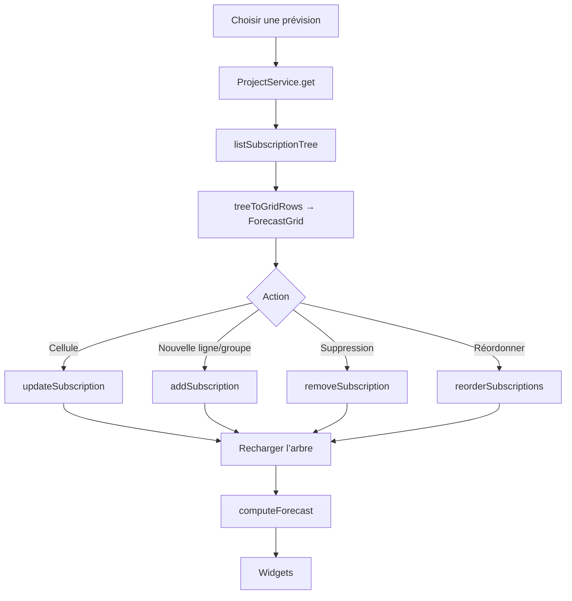

# Carte — Page Prévisionnel

> Référence rapide : fonctions, services et composants de la page Prévisionnel (ex-Gestion de Projets).

---

## Identité

| Champ | Valeur |
|-------|--------|
| Route | `/previsionnel` (`/project-management` redirige ici) |
| Fichier page | `src/pages/Previsionnel/Previsionnel.tsx` |
| Stockage | SQLite `projects` + `project_subscriptions` (schéma V4) |

---

## Services

| Service | Rôle |
|---------|------|
| `ProjectService` | CRUD prévisions, arbre d’abonnements, layout widgets |
| `ProjectionService` | `calculateProjection`, `aggregateByPeriod`, `calculateStats` |
| `ForecastModel` | Arbre ↔ lignes de grille, calcul des widgets |
| `ConfigService` | Catégories (couleurs / libellés) |

---

## Composants

| Composant | Rôle |
|-----------|------|
| `PrevisionnelToolbar` | Sélection / création / suppression, période, solde, actions lignes |
| `ForecastGrid` | Grille métier, colonnes configurables/redimensionnables, menu contextuel |
| `PrevisionnelWidgetPanel` | Zone graphiques modulable (widgets on/off + ordre) |
| `PrevisionnelWidget` | Encart graphique |

Widgets : synthèse, évolution du solde, débits/crédits, par catégorie, par ligne.

Le menu contextuel de la colonne Nom insère ligne/groupe ou ouvre les dialogues
catégorie/transaction. Le menu d’en-tête contrôle les colonnes et leurs types.

---

## Tables SQLite

| Table | Usage |
|-------|-------|
| `projects` | Nom, dates, solde initial, `widget_layout` JSON |
| `project_subscriptions` | Lignes débit/crédit + groupes (`parent_id`, `is_group`) |

---

## Processus



## Fonctions internes

```
loadList / loadProject / persistConfig / handleSelect / handleCreate / handleDeleteForecast
handleAddLine / handleAddGroup / handleDuplicate / handleDeleteRow / handlePatch
handleLayoutChange / handleColumnsChange / handleColumnWidthsChange
openFromCategory / openFromTransaction / handleDraftLine
treeToGridRows / computeForecast (ForecastModel)
```

L’onglet **Projection vs Réalité** lit les mêmes prévisions via `ProjectService` / `ProjectionService.calculateByCategory`. Lien « Gérer les prévisions » vers `/previsionnel`.
