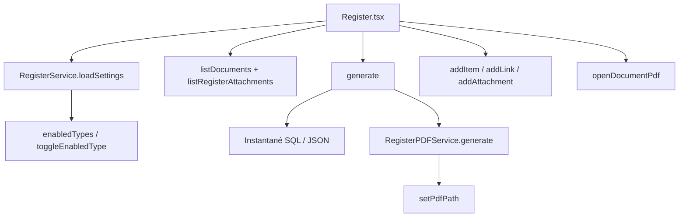

# Carte — Page Registre

> Référence rapide : fonctions, services et composants propres à la page Registre.

---

## Identité

| Champ | Valeur |
|-------|--------|
| Route | `/registre` |
| Fichier page | `src/pages/Register/Register.tsx` |
| CSS | `src/styles/register-custom.css` |

---

## Arborescence des fonctions

```
Register.tsx
├── Fonctions internes
│   ├── load(selectId?)
│   ├── chooseType(next)
│   ├── applyEnabledTypes(enabled)
│   ├── toggleEnabledType(nextType)
│   ├── createPdf(document)
│   ├── generate(event)
│   ├── refreshPdf()
│   ├── openPdf(document)
│   ├── addItem(event)
│   ├── addLink(event)
│   ├── attach(documentId, files)
│   └── confirmDelete()
├── Composants
│   ├── RegisterTypeEnableList
│   └── ConfirmModal
├── Services
│   ├── RegisterService
│   │   ├── loadSettings / saveSettings / toggleEnabledType / enabledTypes
│   │   ├── listDocuments / generate / setPdfPath / documentKind / deleteDocument
│   │   ├── addItem / addLink / addAttachment / listRegisterAttachments
│   │   └── openAttachment / openDocumentPdf / previewNumber
│   ├── RegisterPDFService
│   │   ├── generate(document, settings)
│   │   └── generatePreviewDataUrl
│   └── Logger.error
└── Utils
    └── invoiceFormat.formatMoney
```

---

## Services utilisés

| Service | Méthodes appelées depuis la page |
|---------|----------------------------------|
| `RegisterService` | `listDocuments`, `listRegisterAttachments`, `loadSettings`, `enabledTypes`, `toggleEnabledType`, `generate`, `setPdfPath`, `documentKind`, `addItem`, `addLink`, `addAttachment`, `openDocumentPdf`, `deleteDocument` |
| `RegisterPDFService` | `generate` |
| `Logger` | `error` |

---

## Composants enfants

| Composant | Rôle |
|-----------|------|
| `RegisterTypeEnableList` | Cases Association / Entreprise, au moins un type |
| `ConfirmModal` | Confirmation de suppression |

Le même `RegisterTypeEnableList` est réutilisé dans `RegisterSettingsPanel` (Paramètres).

---

## Tables SQLite

| Table | Usage |
|-------|-------|
| `register_settings` | Singleton numérotation, PDF, `enabledTypes` |
| `register_documents` | Métadonnées + `snapshot` JSON + `pdf_path` |
| `register_items` | Éléments libres |
| `register_links` | Références |
| `register_attachments` | Pièces jointes globales ou liées à un document |

---

## Schéma d’appel


