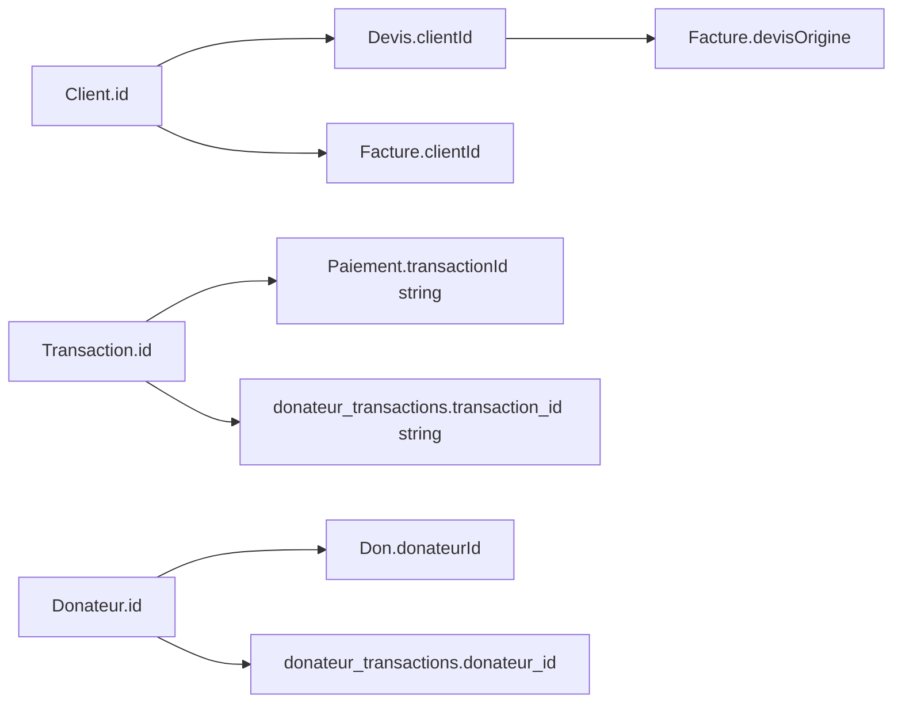

# Conventions métier

## Dates

| Contexte | Format persisté | Traitement |
|---|---|---|
| Transactions et prévisions | `yyyy-MM-dd` | Tri lexical et fonctions SQLite `date`/`strftime` |
| Payloads facturation | ISO 8601 avec heure | Sérialisation `toISOString`, réhydratation `parseDateOrNow` |
| Reçus | Dates texte | Type `ReceiptEntry`, conservation de la date d’émission/annulation |
| Imports | Formats source multiples | `parseDateWithMultipleFormats` puis `toIsoDate` |

Une date invalide ne doit pas être insérée directement : les regroupements SQL supposent le format
ISO date-only.

## Montants

- Un débit est nul ou négatif.
- Un crédit est nul ou positif.
- Le mouvement net vaut `debit + credit`.
- Le solde vaut `initial_balance + SUM(debit + credit)`.
- Les comparaisons de paiement utilisent une tolérance stricte de 0,05.
- Les totaux de facture sont calculés depuis les postes, jamais saisis comme source indépendante.

Pour une colonne bancaire signée, le rôle d’import est `debitCredit`. Une valeur négative alimente
le débit ; une valeur positive alimente le crédit.

## Catégories

| Code | Convention |
|---|---|
| `X` | Exclu des KPI et analyses configurées avec `excludeCategories` |
| `Y` | Transfert interne, également exclu des graphiques Dashboard |
| `NULL`/vide | Non catégorisé, cible de l’auto-catégorisation |

`transactions.category_code` n’est pas une FK. Un renommage via `ConfigService` propage le code ;
une écriture directe doit faire de même.

## Identifiants et relations logiques

Les comptes, catégories, imports, transactions et prévisions utilisent des identifiants entiers.
Les contacts, documents, donateurs, reçus et éléments de catalogue utilisent des identifiants texte.

Relations maintenues par le code, non par SQLite :

Une suppression ou migration doit vérifier ces liens explicitement.

## Payloads JSON

- Les noms de propriétés suivent les types TypeScript en camelCase.
- Les colonnes SQL indexables restent en snake_case.
- Les propriétés `Date` sont des chaînes ISO dans SQLite.
- `invoice_settings.payload` ne contient pas l’objet `emetteur`, stocké séparément.
- `linkedAccounts` contient des objets `EmetteurAccountLink`, pas de simples codes.
- `kind` sépare les postes `facturation` et `association`.

## Documents

### Devis

- Numéro unique contrôlé par `InvoiceService`.
- Caducité signée et datée.
- Conservation du document : pas de suppression physique dans le flux normal.
- Pièces jointes client distinctes du PDF généré.

### Factures

- Une facture issue d’un devis conserve `devisOrigine`.
- Une facture ne peut pas provenir d’un devis caduc.
- Les paiements sont inclus dans le payload.
- Le statut dépend du reste, des paiements et de l’échéance.

### Reçus

- Format `RECU-{année}-{séquence sur 4 chiffres}`.
- Le compteur augmente avant l’enregistrement.
- Une annulation marque l’entrée sans la supprimer ni réutiliser le numéro.

## Profils de développement

Un profil généré porte `developmentDatabase: true` dans `info.json`. Ce marqueur autorise sa
régénération avec `--force` et distingue explicitement une fixture d’un profil utilisateur.
