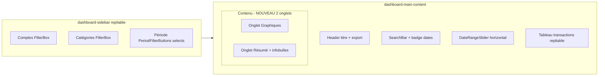
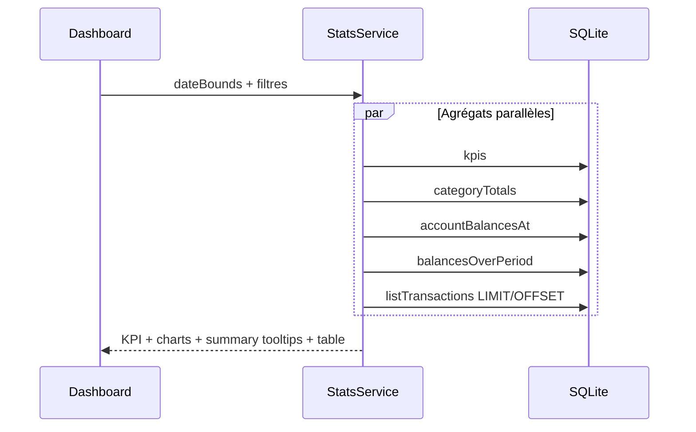

# Plan Dashboard Comptal2.1 — Parité Comptal2 + onglets

## Contexte et prérequis déjà livrés

### Plan 1 ([plan-1-coeur-parametres.md](Comptal2.1/Documentation/plans/plan-1-coeur-parametres.md)) — fondation exploitée
- SQLite par profil (`accounts`, `categories`, `transactions`) via [`db.ts`](Comptal2.1/src/services/db.ts)
- [`ConfigService`](Comptal2.1/src/services/ConfigService.ts) pour lister comptes/catégories
- Logger `withLog`, i18n fr/en, charte `--invoicing-*` + classes `ct-*`
- `MainLayout` / `Sidebar` app déjà en place

### Plan 2 ([plan-2-upload.md](Comptal2.1/Documentation/plans/plan-2-upload.md)) — données alimentant le dashboard
- Import CSV/Excel/manuel → table `transactions` (lots de 100, dates ISO)
- Templates d’import (`import_templates`, schéma v3)
- Le dashboard peut donc afficher des profils réels post-import ou post-migration Comptal2

### Plan 4 ([plan-4-dashboard.md](Comptal2.1/Documentation/plans/plan-4-dashboard.md)) — cœur **fonctionnel** livré, polish **incomplet**
| Livré | Manquant vs Comptal2 / plan |
|-------|----------------------------|
| [`StatsService.ts`](Comptal2.1/src/services/StatsService.ts) (KPI, camemberts, soldes, pagination SQL) | Export CSV, tri colonnes, états vide/chargement |
| 10 composants Dashboard + Chart.js | CSS [`dashboard-custom.css`](Comptal2.1/src/styles/dashboard-custom.css) quasi vide (1 règle) |
| Filtres + graphiques + tableau paginé | Sidebar repliable, sections filtres repliables |
| Agrégats SQL parallèles | `PeriodFilterButtons` simplifié (4 boutons vs 3 `<select>` Comptal2) |
| | **Disposition temporelle** : slider actuellement dans la sidebar alors que Comptal2 le met en zone principale |

**Écart layout actuel Comptal2.1** ([`Dashboard.tsx`](Comptal2.1/src/pages/Dashboard/Dashboard.tsx) L159–241) : tout est empilé dans un `aside` (filtres + recherche + presets + slider). Comptal2 sépare clairement sidebar filtres / contenu principal.

---

## Référence Comptal2 (lecture seule)

Fichiers clés :
- [`Comptal2/src/renderer/pages/Dashboard/Dashboard.tsx`](Comptal2/src/renderer/pages/Dashboard/Dashboard.tsx)
- [`Comptal2/src/renderer/styles/dashboard-custom.css`](Comptal2/src/renderer/styles/dashboard-custom.css) (~1580 lignes)
- [`Comptal2/src/renderer/components/Dashboard/PeriodFilterButtons.tsx`](Comptal2/src/renderer/components/Dashboard/PeriodFilterButtons.tsx) — 3 listes déroulantes semaine/mois/année

Disposition Comptal2 :



**Règle de séparation temporelle à reproduire :**
- **Sidebar** : presets de période (`PeriodFilterButtons` avec selects dynamiques depuis `minDate`/`maxDate` des transactions)
- **Zone principale** : badge `dd/MM/yyyy → dd/MM/yyyy` + `SearchBar` + `DateRangeSlider` (sync bidirectionnelle avec les selects)
- Retirer le slider de la sidebar Comptal2.1 actuelle

---

## Objectifs de cette refonte

1. **Performance** : conserver l’architecture SQL du plan 4 (aucun retour au filtrage JS Comptal2)
2. **Ergonomie Comptal2** : layout sidebar repliable, sections filtres repliables, cartes KPI colorées, mini-cartes horizontales scrollables
3. **Innovation demandée** : remplacer les sections repliables Infos/Graphiques par **2 onglets** ; conserver le tableau en section repliable sous les onglets
4. **Infobulles dynamiques** (onglet Résumé) : contenu recalculé à chaque changement de filtre/période

---

## Partie esthétique — parité Comptal2 + 2 onglets

### A. Layout global

Refactoriser [`Dashboard.tsx`](Comptal2.1/src/pages/Dashboard/Dashboard.tsx) :

```tsx
<div className="dashboard-container">
  <aside className={`dashboard-sidebar ${collapsed ? 'collapsed' : ''}`}>…</aside>
  <main className="dashboard-main-content">…</main>
</div>
```

Porter/adapter depuis Comptal2 dans [`dashboard-custom.css`](Comptal2.1/src/styles/dashboard-custom.css) :
- `.dashboard-container`, `.dashboard-sidebar`, `.sidebar-filter-section`, `.filter-section-header`
- `.dashboard-main-content`, `.dashboard-header`, `.dashboard-search-section`, `.date-range-display-badge`, `.dashboard-date-slider-section`
- `.stat-card`, `.stat-card-balance|expenses|income`, `.account-cards`, `.mini-card`
- `.dashboard-charts-section`, `.chart-container`, onglets (réutiliser le pattern de [`FinanceGlobal.tsx`](Comptal2.1/src/pages/FinanceGlobal/FinanceGlobal.tsx) L93–110 avec classes CSS dédiées plutôt qu’inline styles)
- Mode sombre via `.dark` / `html.dark`
- **Mapper les couleurs** sur les variables `--invoicing-*` existantes plutôt que dupliquer un bloc `:root` complet (règle charte Comptal2.1)

Icônes : **lucide-react** (`Building2`, `Tags`, `Calendar`, `ChevronLeft`, `Wallet`, etc.) — pas FontAwesome.

### B. Sidebar filtres (comme Comptal2)

| Section repliable | Contenu | Référence |
|-------------------|---------|-----------|
| Comptes | [`FilterBox`](Comptal2.1/src/components/Dashboard/FilterBox.tsx) | Comptal2 L413–434 |
| Catégories | `FilterBox` | Comptal2 L436–457 |
| Période | `PeriodFilterButtons` refondu | Comptal2 L459–480 |

**Refonte [`PeriodFilterButtons.tsx`](Comptal2.1/src/components/Dashboard/PeriodFilterButtons.tsx)** :
- Reprendre la logique Comptal2 (52 semaines, 24 mois, N années depuis `bounds.min`)
- Props : `minDate`, `maxDate` (ISO → `Date`), `onPeriodChange(startIso, endIso)`
- 3 `<select>` stylés `.period-filter-select` + labels lucide
- Conserver éventuellement 4 boutons rapides (semaine/mois/année/tout) **en plus** des selects, en dessous — optionnel, non bloquant

Déplacer **`SearchBar`** et **`DateRangeSlider`** vers la zone principale (Comptal2 L499–534).

### C. Deux onglets dans la zone principale (nouveauté)

Créer un petit composant [`DashboardViewTabs.tsx`](Comptal2.1/src/components/Dashboard/DashboardViewTabs.tsx) :

| Onglet | Id | Contenu |
|--------|-----|---------|
| **Graphiques** | `charts` | Grille 3 graphiques Chart.js existants |
| **Résumé** | `summary` | KPI + mini-cartes avec infobulles |

Style onglets : reprendre `.invoicing-carousel-tab` / pattern FinanceGlobal — actif = `--invoicing-primary`, inactif = `--invoicing-gray-50` + bordure.

#### Onglet 1 — Graphiques dynamiques
Extraire dans [`DashboardChartsPanel.tsx`](Comptal2.1/src/components/Dashboard/DashboardChartsPanel.tsx) :
- [`ChartJsPieChart`](Comptal2.1/src/components/Dashboard/ChartJsPieChart.tsx) — dépenses par catégorie (exclure X/Y)
- [`IncomePieChart`](Comptal2.1/src/components/Dashboard/IncomePieChart.tsx)
- [`AccountBalanceLineChart`](Comptal2.1/src/components/Dashboard/AccountBalanceLineChart.tsx)
- Layout `.dashboard-charts-section` : 2 camemberts côte à côte + courbe pleine largeur (responsive `auto-fit`)
- Les graphiques Chart.js gardent leurs tooltips natifs (déjà configurés avec `chart.tooltipLabelWithPercentage`)

#### Onglet 2 — Résumé avec infobulles dynamiques
Extraire dans [`DashboardSummaryPanel.tsx`](Comptal2.1/src/components/Dashboard/DashboardSummaryPanel.tsx) :

**Cartes KPI** (style `.stat-card` Comptal2, icônes lucide) :
- Solde net / Dépenses / Revenus (données `StatsService.kpis`, exclure cat `X`)
- Infobulle au survol (via composant commun) :
  - Période filtrée (`dateStart` → `dateEnd`)
  - Nombre de transactions (`kpis.count`)
  - Formule : ex. « Revenus = Σ crédits hors catégorie X »

**Mini-cartes comptes** — enrichir [`MiniAccountCards.tsx`](Comptal2.1/src/components/Dashboard/MiniAccountCards.tsx) :
- Style Comptal2 `.mini-card` + bordure gauche couleur compte
- Infobulle dynamique : nom complet, solde, **% du total**, solde initial du compte (`accounts.initial_balance`)

**Mini-cartes catégories** — enrichir [`MiniCategoryCards.tsx`](Comptal2.1/src/components/Dashboard/MiniCategoryCards.tsx) :
- Moyenne mensuelle (logique actuelle `net / months`)
- Infobulle : total sur période, moyenne/mois, part des dépenses (%), nb transactions

**Composant infobulle** : [`InfoTooltip.tsx`](Comptal2.1/src/components/Common/InfoTooltip.tsx)
- Survol/focus sur la carte ou icône `Info` lucide
- Portal CSS (pattern inspiré de `inventaire-excel-th-tooltip-portal` Comptal2) — **sans nouvelle dépendance**
- Props : `content: ReactNode` recalculé quand filtres changent

### D. Tableau transactions (inchangé conceptuellement, polish)
- Rester en **`CollapsibleSection`** sous les onglets (comme Comptal2 section Tableau)
- Améliorer [`TransactionsTable.tsx`](Comptal2.1/src/components/Dashboard/TransactionsTable.tsx) : tri par colonne (date, montant, libellé)
- Pagination : compteur « Page N », désactiver → si `< 100` lignes retournées
- Export CSV bouton header (nouveau service léger ou commande Tauri `write_text_file`)

---

## Couche données — extensions minimales

[`StatsService.ts`](Comptal2.1/src/services/StatsService.ts) — ajouter si nécessaire pour les infobulles :

```sql
-- categoryTotals enrichi
SELECT category_code,
       SUM(credit) AS income, SUM(-debit) AS expenses,
       SUM(debit + credit) AS net,
       COUNT(*) AS txCount
FROM transactions t WHERE … GROUP BY category_code
```

Étendre l’interface `CategoryTotal` avec `txCount?: number`. Calcul côté JS du `% des dépenses` pour chaque catégorie.

Pas de refonte de `balancesOverPeriod` en priorité (cumul JS post-SQL acceptable pour v1 esthétique) ; optimiser avec window SQL `SUM() OVER` en tâche secondaire si perf `(perf)` > 100 ms dans les logs.

Ajouter `withLog` sur `listTransactions` (règle logs projet).

---

## Internationalisation

Enrichir [`fr.json`](Comptal2.1/src/i18n/locales/fr.json) / [`en.json`](Comptal2.1/src/i18n/locales/en.json) section `dashboard` :
- `tabCharts`, `tabSummary`, `filters`, `expandSidebar`, `collapseSidebar`
- `selectWeek`, `selectMonth`, `selectYear`, `totalBalance`, `displayingTransactions`
- `loading`, `noData`, `exportTitle`, `filtering`
- `tooltip.kpiNet`, `tooltip.accountBalance`, `tooltip.categoryAverage`, etc.

Clés `chart.tooltipLabelWithPercentage` à reprendre de Comptal2 si absentes.

---

## Fichiers impactés (résumé)

| Action | Fichier |
|--------|---------|
| Refactor majeur | [`Dashboard.tsx`](Comptal2.1/src/pages/Dashboard/Dashboard.tsx) |
| CSS complet | [`dashboard-custom.css`](Comptal2.1/src/styles/dashboard-custom.css) |
| Refonte | [`PeriodFilterButtons.tsx`](Comptal2.1/src/components/Dashboard/PeriodFilterButtons.tsx) |
| Enrichir | [`MiniAccountCards.tsx`](Comptal2.1/src/components/Dashboard/MiniAccountCards.tsx), [`MiniCategoryCards.tsx`](Comptal2.1/src/components/Dashboard/MiniCategoryCards.tsx) |
| Créer | `DashboardViewTabs.tsx`, `DashboardChartsPanel.tsx`, `DashboardSummaryPanel.tsx`, `InfoTooltip.tsx` |
| Améliorer | [`TransactionsTable.tsx`](Comptal2.1/src/components/Dashboard/TransactionsTable.tsx) |
| Créer | `ExportService.ts` ou méthode export dans StatsService |
| Étendre | [`StatsService.ts`](Comptal2.1/src/services/StatsService.ts) |
| i18n | `fr.json`, `en.json` |

**Ne pas modifier** Comptal2 (lecture seule). **Ne pas** ajouter Recharts ni FontAwesome.

---

## Flux de données (inchangé, performant)



Un seul `useCallback load()` déclenché par changement de filtre/période/page — pas de triple filtrage JS.

---

## États UX à ajouter

| État | Comportement |
|------|--------------|
| Chargement initial | Spinner / skeleton cartes pendant `dateBounds` + premier `load` |
| Filtrage | Overlay discret `dashboard.filtering` (Comptal2) |
| Vide | `EmptyState` + lien vers page Upload si `kpis.count === 0` |
| Erreur | `Logger.error` + toast react-toastify |

---

## Validation

1. **Visuel** : comparer côte à côte Comptal2 / Comptal2.1 (clair + sombre) — sidebar, badge dates, slider, cartes KPI, mini-cartes
2. **Onglets** : bascule Graphiques ↔ Résumé sans remount des charts (garder panels montés avec `hidden` ou `display:none`, pas unmount)
3. **Infobulles** : survoler une carte compte/catégorie/KPI → valeurs mises à jour après changement de période
4. **Sync temporelle** : select semaine ↔ slider ↔ badge dates cohérents
5. **Perf** : profil 5000+ transactions, changement filtre < 100 ms requêtes (logs `(perf)` dans `data/logs/`)
6. **Régression** : `npm run typecheck` ; parcours import (plan 2) puis dashboard avec données réelles

---

## Ordre d’implémentation recommandé

1. CSS layout + structure `dashboard-container` / sidebar repliable
2. Déplacement SearchBar + DateRangeSlider + badge ; refonte `PeriodFilterButtons`
3. Composant onglets + panels Graphiques / Résumé
4. `InfoTooltip` + enrichissement mini-cartes et KPI
5. Polish tableau (tri, pagination, export) + états loading/empty
6. i18n + logs `withLog` manquants
