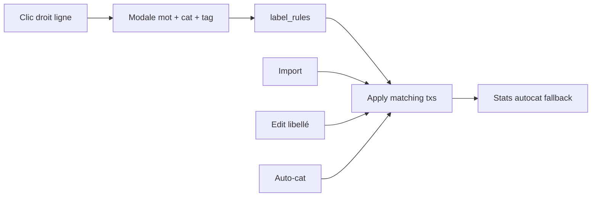

# Facturation compacte, libellés routiniers, projection comparable

Trois changements indépendants, dans `Comptal2.1` uniquement (Comptal2 en lecture seule).

---

## 1. Facturation — bloc PJ signées sur une ligne

Aujourd’hui [`DevisSignedAttachments.tsx`](Comptal2.1/src/components/Facturation/DevisSignedAttachments.tsx) affiche une carte (titre `h3`, hint, état vide 32px, liste verticale). Le trombone toolbar [`DevisAttachButton`](Comptal2.1/src/components/Facturation/DevisSignedAttachments.tsx) reste inchangé.

**Cible visuelle** (référence Comptal2 `invoicing-pdf-link-row`) : une rangée flex, sans carte dashed.

```
[PJ signées]  [fichier.pdf ×] [scan.png ×]  [+ Joindre]
```

- Hint déplacé en `title` / tooltip sur le label (plus de `<p.contact-hint>` ni `.inv-empty` à 32px).
- Liste en `flex-direction: row; flex-wrap: wrap` ; chips plates (`padding: 4px 8px`) : ouvrir au clic, poubelle à côté.
- Si aucune PJ : label + bouton Joindre seulement (pas de message vide).

**CSS** : compactage dans [`facturation-custom.css`](Comptal2.1/src/styles/facturation-custom.css) (`.contact-signed-block` ~4–6px padding, plus de fond/bordure dashed) **et** le doublon [`client-custom.css`](Comptal2.1/src/styles/client-custom.css) — le même composant est réutilisé dans [`ContactElementModal.tsx`](Comptal2.1/src/components/Client/ContactElementModal.tsx).

---

## 2. Édition — libellé routinier (mot → catégorie + étiquette)

L’auto-cat actuelle ([`AutoCategorisationService`](Comptal2.1/src/services/AutoCategorisationService.ts) / table `autocat_stats`) est **statistique**. On n’y mélange pas les règles explicites.

### Données (schéma v11)

Dans [`db.ts`](Comptal2.1/src/services/db.ts) (`SCHEMA_VERSION` 10 → 11), nouvelle table + colonne :

```sql
CREATE TABLE IF NOT EXISTS label_rules (
  id INTEGER PRIMARY KEY AUTOINCREMENT,
  word TEXT NOT NULL UNIQUE,       -- token UPPER
  category_code TEXT,              -- optionnel
  tag TEXT,                        -- optionnel, ex. "Abonnements"
  active INTEGER NOT NULL DEFAULT 1,
  created_at TEXT NOT NULL
);
ALTER TABLE transactions ADD COLUMN tag TEXT;
```

`TransactionRow` ([`models.ts`](Comptal2.1/src/types/models.ts)) gagne `tag: string | null`. Matching : tokenisation identique à `tokenizeLabel` (mot entier, insensible à la casse) — pas un `includes` brut (évite que `NET` matche `INTERNET`).

### Service [`LabelRuleService.ts`](Comptal2.1/src/services/LabelRuleService.ts)

CRUD + `match(label)` + `applyToTransactions(ids?)` (journalisé `withLog`). Politique :

- Catégorie : uniquement si la transaction n’en a pas encore.
- Étiquette : écrite si la règle en a une et que `tag` est vide (une étiquette par ligne en V1).
- Plusieurs règles matchent : mot le plus long d’abord.

**Quand ça s’applique**

- À la création d’une règle → toutes les lignes existantes matchantes.
- Après import ([`ImportService`](Comptal2.1/src/services/ImportService.ts), lignes du `import_id`).
- À la modification du libellé ([`Edition.handleUpdate`](Comptal2.1/src/pages/Edition/Edition.tsx)).
- Avant le passage statistique de l’auto-cat (`runAutocat`) : les règles remplissent d’abord les non-catégorisées.

### UI Édition

Menu contextuel de [`TransactionTable.tsx`](Comptal2.1/src/components/Edition/TransactionTable.tsx) : **« Libellé routinier… »**.

Modale `RoutineLabelModal` (`components/Edition/`, `Modal` existant) :

1. Chips des tokens du libellé de la ligne (un mot à choisir).
2. Catégorie optionnelle (liste existante, préremplie avec celle de la ligne).
3. Étiquette optionnelle (texte libre + suggestions des étiquettes déjà utilisées via `SuggestInput`).
4. Enregistrer → crée la règle + applique.

Nouvelle colonne **Étiquette** (après catégorie), largeur persistée dans [`editionUi.ts`](Comptal2.1/src/types/editionUi.ts) ; lecture/écriture via [`EditionService`](Comptal2.1/src/services/EditionService.ts).

Gestion : liste compacte dans [`DataTab.tsx`](Comptal2.1/src/components/Parametre/DataTab.tsx) (mot / catégorie / étiquette / supprimer) pour corriger une règle sans passer par le SQL.

i18n `fr.json` / `en.json` (clés `edition.routineLabel*`, `settings.data.labelRules*`).



---

## 3. Finance Global — sélecteur de graphique Prévisionnel vs réel

Rester dans l’onglet existant `projection` ([`ProjectionVsReality.tsx`](Comptal2.1/src/components/FinanceGlobal/ProjectionVsReality.tsx)), à côté du sélecteur de projet.

**Sélecteur de vue** (un graphique à la fois) :

| Mode | Graphique | Données réel | Données prévu |
|------|-----------|--------------|---------------|
| Évolution du solde | 2 courbes Chart.js | Somme des soldes comptes filtrés (`balancePoints` déjà chargés par [`FinanceGlobal.tsx`](Comptal2.1/src/pages/FinanceGlobal/FinanceGlobal.tsx) via `StatsService.balancesOverPeriod`) | `ProjectionService.calculateProjection` + `aggregateByPeriod` (`initialBalance` du projet) |
| Une catégorie | Barres groupées (Réel / Prévisionnel) par période | `realityByCategory` filtré | `projectionByCategory` filtré + **dropdown catégorie** (union réel ∩ prévu, 1re cat. par défaut) |
| Toutes catégories | Vue actuelle `ProjectionVsRealityChart` (barres empilées hachurées) | inchangé | inchangé |

Le 3ᵉ mode évite de perdre la comparaison globale déjà livrée ; le sélecteur répond à « un graphique affiché à la fois ».

**Fichiers**

- Étendre [`ProjectionVsReality.tsx`](Comptal2.1/src/components/FinanceGlobal/ProjectionVsReality.tsx) : `viewMode`, `selectedCategory`, passer `balancePoints` depuis la page.
- Nouveau [`BalanceVsProjectionChart.tsx`](Comptal2.1/src/components/FinanceGlobal/BalanceVsProjectionChart.tsx) (ligne, 2 datasets, légende cliquable comme le Dashboard).
- Nouveau [`CategoryVsProjectionChart.tsx`](Comptal2.1/src/components/FinanceGlobal/CategoryVsProjectionChart.tsx) (barres groupées, réel plein / prévu hachuré — même convention que l’existant).
- Tableau sous le chart : période × réel × prévu (allévé pour solde et 1 cat.) ; tableau actuel conservé pour « Toutes catégories ».
- i18n `financeGlobal.projectionView*` ; styles dans `finance-global-custom.css` si besoin (sélecteur compact type `ct-select`).

**Alignement des périodes** : même `filterPeriodKeysInRange` + granularité déjà utilisés. Le solde réel (comptes sélectionnés) et le solde projeté (`initialBalance` du projet) peuvent partir de bases différentes — c’est voulu, pas de recalage automatique.

---

## Hors scope

- Pas de tags multi-valeurs ni filtre Étiquette dans la sidebar Édition (V1 = une étiquette, colonne visible).
- Pas d’écrasement d’une catégorie déjà saisie par une règle.
- Comptal2 non modifié.
