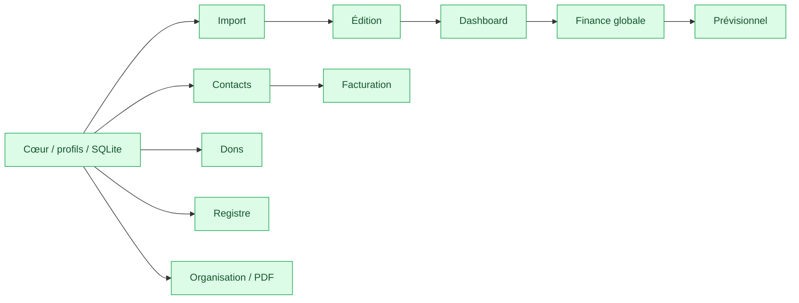
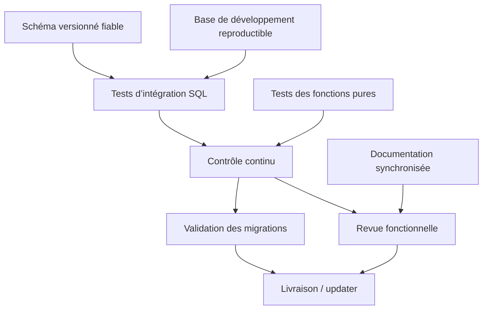

# Plan directeur actuel — Comptal2.1

## 1. Finalité

Ce plan remplace le statut des anciens plans lorsqu’ils divergent du code. Il ne réécrit pas
l’historique : il décrit le produit réellement présent et l’ordre logique des consolidations.

## 2. État des lots

| Lot | Statut | Source principale |
|---|---|---|
| Cœur Tauri, profils, paramètres, SQLite | Réalisé | `main.tsx`, `ProfileService`, `db.ts` |
| Import CSV/XLSX/manuel et modèles | Réalisé | `pages/Upload`, `ImportService` |
| Édition, catégories, doublons, historique | Réalisé | `pages/Edition`, `EditionService` |
| Dashboard et filtres temporels | Réalisé | `pages/Dashboard`, `StatsService` |
| Finance globale | Réalisé | `pages/FinanceGlobal`, `StatsService` |
| Prévisionnel | Réalisé | `pages/Previsionnel`, `ForecastModel` |
| Contacts et groupements | Réalisé | `pages/Client`, `ClientService` |
| Devis, factures, postes et paiements | Réalisé | `pages/Facturation`, `InvoiceService` |
| Association, dons et reçus | Réalisé | `pages/Association`, `DonationService` |
| Registre documentaire | Réalisé | `pages/Register`, `RegisterService` |
| Organisation, mentions et modèles PDF | Réalisé | `OrganizationTab`, services PDF |

## 3. Consolidations prioritaires

Ces étapes ne sont pas des fonctionnalités fictives ; elles correspondent aux risques observables
dans l’architecture actuelle.

### A. Schéma et migrations

- Extraire une définition de schéma réutilisable par l’application et les outils de développement.
- Ajouter une migration explicite par nouvelle version en conservant `ensureSchema()` comme
  réparation idempotente.
- Ajouter des contraintes ou validations applicatives aux relations JSON qui ne sont pas des FK
  SQLite (`clients` ↔ `devis`, `donateurs` ↔ reçus, factures ↔ transactions).
- Tester systématiquement `foreign_key_check`, `integrity_check` et l’ouverture d’une base ancienne.

### B. Tests automatisés

- Couvrir les fonctions pures : montants, dates, granularités, projections, calculs de facture.
- Tester les services SQL contre une base temporaire issue du générateur de développement.
- Ajouter des scénarios d’intégration : import → édition → statistiques ; devis → facture → paiement ;
  don → reçu.
- Conserver les tests GUI pour les parcours critiques, sans les utiliser comme seule preuve.

### C. Robustesse métier

- Formaliser les invariants de débit/crédit et de date à l’entrée de chaque service.
- Garantir l’unicité métier des numéros de documents au niveau SQLite ou dans une transaction.
- Documenter et tester les effets de suppression/archivage de contacts liés à des documents.
- Vérifier les collisions de catégories réservées `X` et `Y`.

### D. Exploitation

- Conserver les données utilisateur hors Git et les jeux de test sous forme de générateur.
- Vérifier les migrations avant chaque livraison.
- Tester l’updater sur un canal de préproduction avant publication.
- Documenter chaque nouvelle commande Rust et limiter strictement son périmètre de chemin.

## 4. Dépendances entre évolutions

## 5. Critères de livraison d’un lot

1. Le comportement est relié à une page, un service et des tables identifiés.
2. Les mutations multi-requêtes sont atomiques.
3. Les anciennes bases restent ouvrables ou disposent d’une migration.
4. Le jeu de développement permet de reproduire le parcours.
5. Le typecheck applicable et les contrôles SQL passent.
6. Les pages, cartes de processus et références de code sont mises à jour.

## 6. Documents historiques

Les fichiers `plan-1` à `plan-6` et les fichiers `*.plan.md` sont des archives de conception.
Notamment, le « Plan 6 — Projet — en attente » est dépassé : la fonctionnalité existe désormais
sous le nom Prévisionnel et utilise `projects`/`project_subscriptions`.
