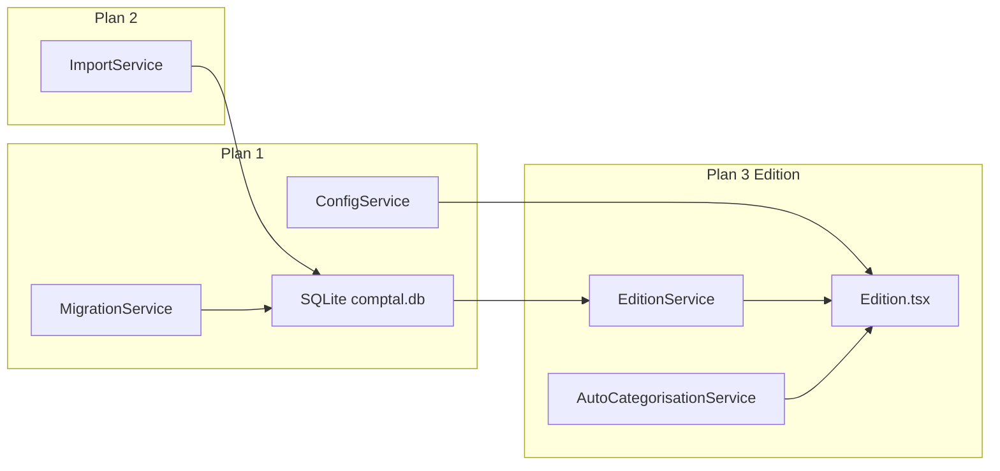
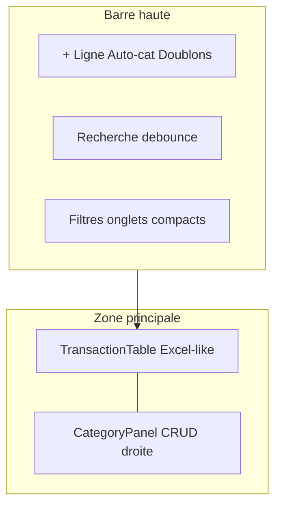
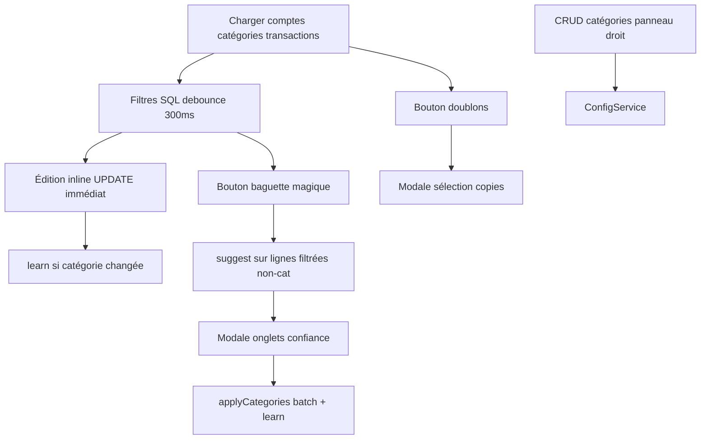

# Plan 3 — Page Edition (édition des transactions)

## Contexte : fondations des plans 1 et 2

Les plans précédents fournissent tout ce dont Edition dépend — **aucune modification de schéma majeure n’est requise**.

### Plan 1 (cœur + Paramètres) — prérequis utilisés par Edition

| Brique | Fichier | Usage Edition |
|--------|---------|---------------|
| SQLite par profil | [`db.ts`](Comptal2.1/src/services/db.ts) | Tables `transactions` (index date/compte/catégorie) + `autocat_stats` |
| CRUD comptes/catégories | [`ConfigService.ts`](Comptal2.1/src/services/ConfigService.ts) | Liste comptes/catégories, futur CRUD légende |
| Logger JSONL | [`logger.ts`](Comptal2.1/src/services/logger.ts) | `withLog` sur services Edition |
| Migration Comptal2 | [`MigrationService.ts`](Comptal2.1/src/services/MigrationService.ts) | Transactions migrées → alimentent Edition (stats auto-cat **non** reconstruites) |
| Charte `ct-*` / `--invoicing-*` | [`variables.css`](Comptal2.1/src/styles/variables.css), [`index.css`](Comptal2.1/src/styles/index.css) | Base UI actuelle |

### Plan 2 (Upload) — source des données Edition

| Brique | Fichier | Lien Edition |
|--------|---------|--------------|
| Import CSV/Excel/manuel | [`ImportService.ts`](Comptal2.1/src/services/ImportService.ts) | `INSERT INTO transactions` par lots → données éditables |
| Schéma v3 templates | `import_templates` dans `db.ts` | Pas d’impact direct Edition |
| Pas d’auto-cat à l’import | plan-2 L52 | Workflow Edition = lieu principal de catégorisation |



---

## Référence Comptal2 (lecture seule)

| Zone | Fichier Comptal2 |
|------|------------------|
| Page orchestrateur (~950 lignes) | `Comptal2/src/renderer/pages/Edition/Edition.tsx` |
| Tableau riche (~1850 lignes) | `Comptal2/src/renderer/components/Edition/CsvEditorTable.tsx` |
| Filtres onglets | `SourceFilterPanel`, `CategoryFilterPanel`, `PeriodFilterPanel` |
| Légende CRUD | `CategoryLegendPanel.tsx` (~325 lignes) |
| Modales | `AutoCategorisationReviewModal`, `CleanDuplicatesModal` |
| Services | `EditionService.ts` (CSV), `AutoCategorisationService.ts` |
| Styles | `edition-custom.css` (~1880 lignes) |

**Principe portage** : ne pas copier `CsvEditorTable` tel quel ; reproduire comportements et rendu au-dessus de SQLite (`transactions.id` stable, `UPDATE` unitaires, filtres en SQL).

---

## Direction esthétique et layout (choix Comptal2.1)

**Objectif** : rester proche de l’esthétique Comptal2 (couleurs `--invoicing-*`, boutons `ct-*`, ombres, thème sombre) mais avec une **disposition différente de Comptal2** — plus orientée tableur Excel, menu en barre haute, gestion des catégories à droite du tableau.

### Layout cible

```
┌─────────────────────────────────────────────────────────────────────────┐
│  Titre page                                                             │
├─────────────────────────────────────────────────────────────────────────┤
│  BARRE HAUTE (toolbar)                                                  │
│  [+ Ligne] [Auto-cat] [Doublons]  │  Recherche  │  Filtres (onglets ou  │
│                                    │             │  dropdowns compacts)  │
├──────────────────────────────┬──────────────────────────────────────────┤
│                              │                                          │
│   TABLEAU EXCEL              │   PANNEAU CATÉGORIES (droite)            │
│   - grille dense, bordures   │   - liste CRUD code/nom/couleur          │
│   - header sticky + tri      │   - repliable (chevron)                  │
│   - édition inline cellule   │   - pastilles couleur Comptal2           │
│   - virtualisation scroll    │   - ajout / édition / suppression        │
│   - pagination footer        │                                          │
│                              │                                          │
└──────────────────────────────┴──────────────────────────────────────────┘
```

**Pas de sidebar gauche** (contrairement à Comptal2). Les actions et les filtres migrent dans la **barre haute** ; le tableau occupe la zone centrale maximale.

### Tableau type Excel (vs Comptal2 actuel)

| Aspect | Comptal2 | Comptal2.1 cible |
|--------|----------|------------------|
| Disposition | Sidebar gauche + tableau + légende droite | Barre haute + tableau large + panneau catégories droite |
| Grille | `#csv-table`, lignes aérées | Grille plus dense : bordures cellules, alignement montants à droite, header fixe |
| Édition | Cellule active, buffer local + Sauvegarder | Édition inline immédiate (SQLite) mais **look** spreadsheet (focus ring, bordure cellule active) |
| Navigation | Clavier flèches/Tab/Enter | Reprendre navigation clavier (Phase 3) |
| Filtres | Onglets dans sidebar | Barre haute : onglets compacts ou groupe boutons (Comptes \| Catégories \| Période) + recherche |

### Charte visuelle (inchangée)

- Variables [`variables.css`](Comptal2.1/src/styles/variables.css) (`--invoicing-primary`, gris, ombres)
- Classes `ct-card`, `ct-btn-primary/secondary`, `ct-input`, `ct-table` — adaptées pour look Excel dans `edition-custom.css`
- Dark mode `.dark` sur barre, tableau et panneau catégories



---

## État actuel Comptal2.1 (plan-3 marqué RÉALISÉ)

### Implémenté et fonctionnel

| Fonction plan-3 | Statut | Fichiers |
|-----------------|--------|----------|
| Filtres compte / catégorie / non-cat / période | OK | [`FilterPanels.tsx`](Comptal2.1/src/components/Edition/FilterPanels.tsx), `buildWhere` dans [`EditionService.ts`](Comptal2.1/src/services/EditionService.ts) L46–75 |
| Recherche debounce 300 ms | OK | [`Edition.tsx`](Comptal2.1/src/pages/Edition/Edition.tsx) L40–43 |
| Tri SQL asc/desc | Partiel | `EditionService.list` + `handleSort` L116–123 |
| Édition inline (date, libellé, montants, catégorie) | Partiel | [`TransactionTable.tsx`](Comptal2.1/src/components/Edition/TransactionTable.tsx) |
| Autocomplete catégorie | Basique | `<datalist>` codes uniquement |
| Insert / delete | OK | `EditionService.insert/remove` + `ConfirmModal` |
| Doublons SQL + modale | OK | `findDuplicates` + [`DuplicatesModal.tsx`](Comptal2.1/src/components/Edition/DuplicatesModal.tsx) |
| Auto-cat statistique | OK | [`AutoCategorisationService.ts`](Comptal2.1/src/services/AutoCategorisationService.ts) |
| Pagination SQL 500 + virtualisation viewport | OK | `PAGE_SIZE` + virtualisation manuelle `TransactionTable` |
| Persistance immédiate (vs save global Comptal2) | Choix SQLite | `handleUpdate` → `EditionService.update` au blur |

### Écarts vs plan-3 et Comptal2

| Écart | Priorité | Détail |
|-------|----------|--------|
| **CSS edition** | Haute | [`edition-custom.css`](Comptal2.1/src/styles/edition-custom.css) = 3 lignes ; styles Excel + barre haute + panneau droit à créer |
| **Layout page** | Haute | Cible : barre haute + tableau Excel + catégories à droite ; actuel : header boutons + légende chips au-dessus + filtres à gauche |
| **Filtre par défaut non-cat** | Moyenne | Comptal2 : `showUncategorized=true` par défaut (workflow « à catégoriser ») ; Comptal2.1 : `uncategorizedOnly=false` |
| **Tri 3 états asc/desc/off** | Moyenne | Plan L23 ; Comptal2 `sortDirection: null` ; Comptal2.1 bascule asc/desc seulement |
| **Légende catégories CRUD** | Moyenne | Plan L28 « réutiliser ConfigService » ; Comptal2 `CategoryLegendPanel` ; Comptal2.1 [`CategoryLegend.tsx`](Comptal2.1/src/components/Edition/CategoryLegend.tsx) lecture seule |
| **Auto-cat sur ensemble filtré** | Moyenne | Comptal2 : toutes lignes filtrées ; Comptal2.1 : uniquement la page courante (500 lignes) |
| **Modale auto-cat par confiance** | Moyenne | Comptal2 : onglets 70–100 % / 40–70 % / ≤40 % + sélection par onglet ; Comptal2.1 : liste plate |
| **Champs tableau** | Moyenne | Absents : `value_date`, compte éditable ; pas menu contextuel insert/delete |
| **États vides / feedback** | Moyenne | Comptal2 : EmptyState → `/upload`, bannière fichiers ignorés, message « tout catégorisé » ; Comptal2.1 : minimal |
| **`rebuildFromTransactions`** | Moyenne | Implémenté L96–115 `AutoCategorisationService` mais jamais appelé (migration / Paramètres) |
| **Navigation clavier tableau** | Basse | Comptal2 `CsvEditorTable` : flèches, Tab, Enter |
| **Logging `count`** | Basse | `EditionService.count` sans `withLog` |

---

## Architecture cible

```
Comptal2.1/src/
├── pages/Edition/Edition.tsx          # orchestrateur : barre haute + grille 2 colonnes
├── components/Edition/
│   ├── EditionToolbar.tsx             # NOUVEAU — barre haute (actions + recherche + filtres)
│   ├── FilterPanels.tsx               # → contenu intégré toolbar (onglets compacts)
│   ├── TransactionTable.tsx           # tableau Excel-like + virtualisation
│   ├── CategoryPanel.tsx            # NOUVEAU — panneau droit CRUD (remplace CategoryLegend)
│   ├── AutoCatReviewModal.tsx         # → onglets confiance
│   └── DuplicatesModal.tsx
├── services/
│   ├── EditionService.ts              # requêtes SQL
│   └── AutoCategorisationService.ts   # stats + suggest + rebuild
└── styles/edition-custom.css          # barre haute, grille Excel, panneau catégories
```

---

## Plan d’implémentation par phases

### Phase 1 — Layout barre haute + tableau Excel + panneau catégories droite

**Objectif** : charte Comptal2 (`--invoicing-*`, `ct-*`) dans une disposition **type Excel** — pas la sidebar gauche de Comptal2.

1. Créer [`EditionToolbar.tsx`](Comptal2.1/src/components/Edition/EditionToolbar.tsx) — barre haute fixe :
   - Groupe gauche : actions `+ Ligne`, `Auto-cat` (Sparkles), `Doublons` (`ct-btn-secondary`)
   - Centre / droite : champ recherche (debounce 300 ms)
   - Filtres compacts : onglets ou boutons `Comptes | Catégories | Période` (style `.filter-nav-button` Comptal2) — contenu de [`FilterPanels.tsx`](Comptal2.1/src/components/Edition/FilterPanels.tsx) réintégré ici, pas en sidebar
2. Restructurer [`Edition.tsx`](Comptal2.1/src/pages/Edition/Edition.tsx) :
   - En-tête titre `text-3xl` + sous-titre (comme Upload)
   - `EditionToolbar` en barre pleine largeur
   - Zone `.edition-workspace` : flex row — **tableau (~70–75 %)** + **panneau catégories (~25 %)** repliable
   - Supprimer layout actuel (légende chips au-dessus, filtres `aside` gauche)
3. Styles Excel dans [`edition-custom.css`](Comptal2.1/src/styles/edition-custom.css) :
   - `.edition-toolbar` — barre haute, bordure basse, fond `--invoicing-gray-50`
   - `.edition-excel-table` — `border-collapse`, bordures cellules `1px solid var(--invoicing-gray-200)`, header sticky, lignes `height` fixe (~36–40 px), montants `text-align: right`, cellule active `.edition-cell-focus`
   - `.edition-category-panel` — panneau droit, scroll interne, repliable
   - Variantes `.dark` pour chaque bloc
4. Porter depuis Comptal2 **uniquement** les éléments utiles (boutons action, onglets filtres, pastilles couleur) — **pas** `.editor-sidebar` ni `.editor-container` sidebar-first

### Phase 2 — Filtres dans la barre haute + comportement par défaut

1. **Filtre par défaut** : `uncategorizedOnly = true` à l’init (aligné Comptal2 L30).
2. **Filtres dans `EditionToolbar`** (pas sidebar) : onglets compacts Comptes | Catégories | Période — contenu actuel de [`FilterPanels.tsx`](Comptal2.1/src/components/Edition/FilterPanels.tsx) :
   - Comptes (par `account_id` / code)
   - Catégories + case « non catégorisées »
   - Période dates
3. **Tri 3 états** : cycle `asc → desc → off` ; quand `off`, défaut `date DESC`.
4. **États vides** :
   - Aucune transaction → lien vers `/upload`
   - Filtre non-cat actif et 0 lignes → message succès vert « tout catégorisé »

### Phase 3 — Tableau Excel et édition inline

1. Appliquer classes `.edition-excel-table` : grille dense, bordures cellules, header sticky, alignement montants.
2. **Colonnes** : ajouter `value_date` (éditable) ; compte via `<select>` des comptes actifs.
3. **Autocomplete catégorie** : suggestions code + nom (max 10) — lien visuel avec panneau catégories droite.
4. **Menu contextuel** (clic droit) : insérer au-dessus / en-dessous, supprimer → `EditionService.insert/remove` + `ConfirmModal`.
5. **Compteur footer** : affichage explicite lignes visibles / total page + pagination.
6. **Navigation clavier** : flèches, Tab, Enter entre cellules (comportement spreadsheet).

### Phase 4 — Auto-catégorisation (alignement algorithme + UX)

L’algorithme est déjà porté (`tokenizeLabel`, `learn`, `suggest`, seuil 0,1). Travail restant :

1. **Portée auto-cat** : nouvelle méthode `EditionService.listUncategorizedIds(filters)` (sans `LIMIT`) ou requête dédiée ; boucle `suggest` côté service ou page — **toutes les lignes du filtre actif**, pas seulement la page.
2. **Modale revue** : enrichir [`AutoCatReviewModal.tsx`](Comptal2.1/src/components/Edition/AutoCatReviewModal.tsx) :
   - Onglets confiance : high (≥70 %), medium (40–70 %), low (≤40 %)
   - « Tout sélectionner » global et par onglet
   - Tout coché par défaut (Comptal2)
3. **Rebuild stats** :
   - Appeler `AutoCategorisationService.rebuildFromTransactions()` après migration dans [`MigrationService.ts`](Comptal2.1/src/services/MigrationService.ts)
   - Bouton « Reconstruire stats auto-cat » dans Paramètres → Données (équivalent Comptal2 Paramètres)

### Phase 5 — Panneau catégories à droite du tableau (CRUD)

Remplacer [`CategoryLegend.tsx`](Comptal2.1/src/components/Edition/CategoryLegend.tsx) par **`CategoryPanel.tsx`** — panneau fixe à droite du tableau Excel (référence logique `CategoryLegendPanel` Comptal2, disposition Comptal2.1) :

- Position : colonne droite de `.edition-workspace`, hauteur alignée sur le tableau, `min-width` ~240 px, repliable via chevron
- Liste verticale : pastille couleur + code + nom (style Comptal2)
- Actions inline ou boutons : **Ajouter**, **Éditer** (nom + couleur), **Supprimer** → `ConfigService` + `ConfirmModal`
- Protection catégorie `X` si présente ; suppression → transactions non catégorisées
- Après CRUD : `categoriesRefreshKey` → recharger filtres toolbar, datalist/autocomplete tableau, pastilles dans le panneau
- Le panneau ne remplace pas Paramètres → Catégories (configuration avancée) ; c’est le **hub de catégorisation** pendant l’édition

### Phase 6 — Doublons et finitions services

1. **Doublons** : comportement actuel (garder 1ʳᵉ occurrence) OK ; optionnel : pré-sélectionner toutes les copies comme Comptal2.
2. **`EditionService.count`** : envelopper avec `withLog` (règle logs).
3. **i18n** : clés pour onglets confiance, états vides, actions légende (`edition.*` fr/en).

---

## Flux utilisateur cible (aligné Comptal2)



---

## Validation (plan L50–52)

| Test | Critère |
|------|---------|
| Persistance | Éditer date/libellé/montants/catégorie → recharger page → valeurs SQL conservées |
| Logs | `EditionService.*`, `AutoCategorisationService.*` dans `data/logs/*_(data|app).jsonl` |
| Performance | > 5 000 lignes : changement filtre < 100 ms (index + pas de chargement mémoire globale) |
| Migration | Après import Comptal2 : `rebuildFromTransactions` remplit `autocat_stats` |
| Auto-cat | Suggestions sur ensemble filtré ; application batch persiste en SQL |
| Visuel | Charte Comptal2 + layout Excel (barre haute, grille dense, panneau catégories droite) en clair/sombre |
| Typecheck | `npm run typecheck` OK |

---

## Estimation d’effort

| Phase | Effort |
|-------|--------|
| 1 — Barre haute + Excel + panneau droit | 1–2 j |
| 2 — Filtres + tri + états vides | 0,5 j |
| 3 — Tableau (colonnes, contexte) | 1 j |
| 4 — Auto-cat portée + modale + rebuild | 1 j |
| 5 — Légende CRUD | 1 j |
| 6 — Finitions | 0,5 j |

**Total ~4–5 j** pour parité complète Comptal2. Le cœur métier SQL (déjà en place) représente ~60 % du plan-3 ; le reste est UX/parité visuelle.
