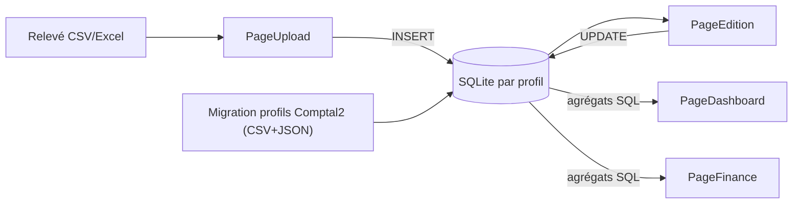

# Refonte Comptal2.1 — Plan directeur en 5 plans

## Décisions d'architecture (validées)

- **Tauri 2 + React 18 + TypeScript + Vite + Tailwind** — le renderer de Comptal2 sert de référence visuelle (charte `charte-visuelle-comptal2.mdc`), les dossiers `src/main` et `src/preload` du squelette seront remplacés par `src-tauri/` (Rust).
- **SQLite** via `@tauri-apps/plugin-sql` : 1 fichier `.db` par profil, remplace les CSV (`profiles/{id}/data/*.csv`) et les ~30 JSON métier. Les JSON restent pour la config légère (langue, dimensions fenêtre, palettes).
- **Auto-updater intégré** : `tauri-plugin-updater` + GitHub Releases (clé de signature, vérification au démarrage, UI de téléchargement/installation dans Paramètres).
- **Chart.js uniquement** (Recharts supprimé), **lucide-react uniquement** (FontAwesome supprimé).
- **Logs JSONL** obligatoires partout (règle `comptal21-logs.mdc`) : logger central TS + côté Rust, fichiers `AAAA-MM-JJ_HH-mm-ss_(type).jsonl`.
- **Fenêtre cadrée** : dimensions précises dans `tauri.conf.json` (défaut 1400×900, min 1024×768), presets réglables dans Paramètres (1280×800 / 1400×900 / 1600×900 / plein écran / personnalisé) appliqués via l'API window de Tauri.

## Schéma SQLite v1 (partagé par tous les plans)

`accounts` (code, nom, couleur, solde initial) · `categories` (code, nom, couleur) · `transactions` (id PK stable, account_id, date, date_valeur, debit, credit, libelle, categorie_id, import_id — index sur date/compte/catégorie) · `imports` (fichier, compte, période) · `autocat_stats` (mot → catégorie, poids). Les agrégations Dashboard/Finance se font en **SQL** (SUM/GROUP BY), plus jamais en boucles JS sur tout le tableau.

---

## Plan 1 — Cœur logiciel + Page Paramètres (fondation, à faire en premier)

- Initialiser le projet Tauri 2 dans [Comptal_Project/Comptal2.1](Comptal_Project/Comptal2.1) : nettoyer le squelette (`src/main`, `src/preload`, `src/Nouveau dossier` supprimés), config fenêtre, plugins `sql`, `updater`, `dialog`, `fs`, `opener`.
- Services fondation : `db.ts` (connexion + migrations de schéma), `logger.ts` (JSONL conforme à la règle), `SettingsService`, `ProfileService` (CRUD profils = 1 dossier + 1 `.db`, export/import ZIP), `ConfigService`.
- Layout global : sidebar, routing (mêmes 8 routes que Comptal2), thème sombre, i18n fr, styles repris de `invoicing-custom.css`/`edition-custom.css`.
- Page Paramètres (6 onglets comme Comptal2) : Général (langue, **dimensions fenêtre**, zoom), Profils, Comptes, Catégories, Données (**migration Comptal2 → SQLite** : lecture des CSV+JSON d'un profil Comptal2 et insertion en base), À propos (**mises à jour** : version, vérifier, télécharger, installer).
- Mettre à jour les règles `.cursor/rules/comptal21-*.mdc` (chemin réel `Comptal2.1`, arborescence `src-tauri/`, structure `data/` réelle) et écrire les 5 plans en `.md` dans `Comptal2.1/Documentation/plans/` pour les futurs agents.

## Plan 2 — Page Upload

- Reprendre le wizard existant (référence : `pages/Upload/Upload.tsx` + services `FileDetectionService`, `ColumnMappingService`, `CSVTransformService`, `ExcelSheetService`) : dropzone CSV/XLSX, sélection de feuilles Excel → comptes, détection auto des colonnes (date, libellé, débit/crédit signé ou séparé, solde), validation UI du mapping, solde initial, prévisualisation, création manuelle.
- Différence clé : la sortie n'est plus un CSV mais des **INSERT en base** (table `transactions` + ligne `imports`), soldes recalculés en SQL après tri chronologique. Détection de doublons à l'import (période déjà importée pour ce compte).
- Pas d'auto-catégorisation à l'import (parité avec Comptal2, elle reste dans Edition).

## Plan 3 — Page Edition

- Tableau des transactions sur SQLite : filtres (compte, catégorie, non-catégorisées, période), recherche avec debounce et tri traduits en **SQL (WHERE/ORDER BY)** ; virtualisation (react-window) pour les gros volumes.
- Édition inline par `id` PK stable (corrige la clé fragile `Source|rowIndex|Date|Libellé` de Comptal2), insertion/suppression de lignes, sauvegarde = UPDATE unitaires (plus de réécriture de fichiers entiers).
- Auto-catégorisation statistique par mots (portage de `AutoCategorisationService`, stats dans la table `autocat_stats`), modale de revue des suggestions, nettoyage des doublons via requête SQL, légende/CRUD catégories.

## Plan 4 — Page Dashboard (refonte performance)

- **À conserver** (identifiés fonctionnels) : `FilterBox`, `SearchBar`, `PeriodFilterButtons`, `MiniAccountCards`, `MiniCategoryCards`, `DateRangeSlider`, `AccountBalanceLineChart` (Chart.js) — portés avec `React.memo`.
- **Causes de lenteur corrigées par conception** : triple refiltrage de `DataService.filterTransactionsAdvanced` → 1 seule requête SQL par vue ; `getAccountBalancesOverPeriod` O(comptes×périodes×transactions) → somme cumulée SQL ; tableau `SortableTable` non virtualisé rendant toutes les lignes → tableau paginé/virtualisé ; `CollapsibleSection` défini dans le composant page (remounts des charts) → extrait ; camemberts sans mémoïsation → `useMemo`.
- KPI (solde net, dépenses, revenus), 3 graphiques Chart.js (camembert catégories, revenus vs dépenses, courbes de soldes), composants legacy Recharts non repris.

## Plan 5 — Page Finance

- 4 onglets repris de `FinanceGlobal.tsx` : Graphique mensuel (barres par catégorie/période), Solde (empilé par compte), Projection vs Réalité (comparaison projet de projection ↔ transactions réelles), Bilan (crédits/débits par catégorie + récap) — tous alimentés par agrégats SQL avec granularité jour→année et plage de dates.
- Tableaux sous graphiques refaits proprement (les overlays `::before/::after` fragiles documentés dans `bugs-solutions.mdc` sont remplacés par un vrai `position: sticky`).
- Portage de `ProjectionService` (nécessaire à l'onglet Projection) ; les composants morts (`StatsGrid`, `TrendChart`, `ComparisonChart`, `RecurringExpenses`) ne sont pas repris.

## Plan 6 — Page Projet : EN ATTENTE

Non planifié pour l'instant, conformément à ta demande. Base identifiée pour plus tard : `ProjectionService` + onglet « Projection vs Réalité » de Finance, à faire évoluer vers projection + exploration comptable sur données réelles.

## Hors périmètre de ces 5 plans

Pages Association et Entreprise (Invoicing, ~12 000 lignes) : éclatement en pages distinctes prévu dans une phase ultérieure, comme demandé.

## Ordre d'exécution et dépendances

Plan 1 (fondation obligatoire) → Plan 2 (alimente la base) → Plan 3 (édite les données) → Plan 4 puis Plan 5 (consomment les agrégats). Chaque plan se termine par un test de l'app (`npm run tauri dev`) et les logs JSONL vérifiés.