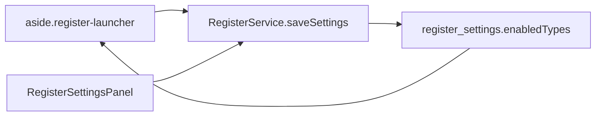

# Personnalisation Registre + enrichissement Dashboard

## 1. Page Registre — masquer / montrer les types dans le launcher

Le filtrage existe déjà via `enabledTypes` (SQLite profil, table `register_settings`) et l’UI Paramètre → Organisation → Registres et PDF. Il n’est **pas** éditable depuis [`Register.tsx`](Comptal2.1/src/pages/Register/Register.tsx).

**Choix retenu (votre réponse) : les deux surfaces**, même source de vérité.



- Extraire une liste réutilisable `RegisterTypeEnableList` dans [`Comptal2.1/src/components/Register/RegisterTypeEnableList.tsx`](Comptal2.1/src/components/Register/RegisterTypeEnableList.tsx) (cases Association / Entreprise, au moins 1 type, mêmes libellés que [`registerTypes.ts`](Comptal2.1/src/constants/registerTypes.ts)).
- Dans le launcher : bouton icône `Settings` / `Eye` à côté de « Nouvelle génération » qui déplie le panneau. Sauvegarde **immédiate** via `RegisterService.saveSettings` (pas de bouton Enregistrer séparé, pour coller à l’usage « je masque et c’est pris en compte »).
- Réutiliser le même composant dans [`RegisterSettingsPanel.tsx`](Comptal2.1/src/components/Parametre/RegisterSettingsPanel.tsx) (le bouton Enregistrer Paramètre continue de sauver le reste : numérotation, PDF).
- Si le type actuellement sélectionné est masqué → basculer sur le premier type encore actif.
- Styles dans [`register-custom.css`](Comptal2.1/src/styles/register-custom.css) (panneau compact, charte `--invoicing-*`).
- Logger `withLog('RegisterService.saveSettings', …)` déjà en place ; journaliser le toggle launcher (`fn` dédié).

---

## 2. Dashboard — bouton Réglages et personnalisation

Aujourd’hui : 3 graphiques trésorerie + KPI résumé, **aucune pref persistée**, aucune branche Facturation / Association ([`Dashboard.tsx`](Comptal2.1/src/pages/Dashboard/Dashboard.tsx)).

### 2.1 Bouton et persistance

- Bouton `Settings` (lucide) dans `.dashboard-header`, à gauche de l’export CSV existant.
- Modale [`DashboardSettingsModal.tsx`](Comptal2.1/src/components/Dashboard/DashboardSettingsModal.tsx) (composant `Modal` existant) : cases par **widget** (graphique ou bloc résumé), groupées Trésorerie / Facturation / Association / Contacts / Rappels.
- Table singleton `dashboard_settings` (schéma **V12** dans [`db.ts`](Comptal2.1/src/services/db.ts)), payload JSON **par profil** — même pattern que `register_settings`.
- Défauts : trésorerie ON ; facturation / dons / contacts / rappels ON seulement si le menu correspondant est visible (`menuVisibility`) **et** qu’il y a des données ou que l’émetteur est du bon type (`EmetteurService.loadEmetteurExtended().type`).

Types prévus (`types/dashboard.ts`) :

```ts
widgets: {
  charts: { expensesByCategory, incomePie, accountBalances, invoiceVsPayment, invoiceAging, donationsByDonor } /* bool */
  summary: { treasuryKpis, invoicingKpis, associationKpis, contactKpis, legalReminders, miniCards, topCategories }
}
donationsByDonorMode: 'period' | 'cumulative'  // défaut: cumulative
```

---

## 3. Filtres — tout le Dashboard reste dynamique

Les widgets **nouveaux** consomment les **mêmes** `dateStart` / `dateEnd` / `search` / comptes / catégories que la trésorerie. Service unique [`DashboardInsightsService.ts`](Comptal2.1/src/services/DashboardInsightsService.ts) appelé en parallèle de `StatsService` dans `load()`.

| Filtre | Trésorerie (existant) | Factures / paiements | Dons | Contacts / rappels |
|---|---|---|---|---|
| Dates | tx | `dateFacture` / `datePaiement` | `donation_date` | pièces et échéances dans la période |
| Recherche | libellé tx | n° facture, nom client | libellé donateur / description | nom, email |
| Comptes | tx | paiements liés (`paiements.transactionId`) ; factures sans lien **incluses** (la facture n’a pas de compte) | dons liés à une tx du compte ; dons manuels **inclus** | n/a |
| Catégories | tx | n/a (pas de catégorie facture) | dons liés à une tx de la catégorie ; dons manuels inclus | n/a |

Principe : un filtre qui n’a pas de sens métier **n’exclut pas** la donnée (facture sans paiement lié, don manuel). Un bandeau discret « Filtre comptes : N factures sans paiement rattaché restent affichées » seulement si un filtre compte/catégorie est partiel.

---

## 4. Graphiques — choix documentés (recherche web)

Stack inchangée : **Chart.js uniquement**, already registered in [`registerCharts.ts`](Comptal2.1/src/utils/registerCharts.ts) (`BarElement` déjà là ; stacked déjà utilisé dans Finance Global).

### 4.1 Facturation — Facturé vs Encaissé (demandé)

Consensus AR / recouvrement (DCN Recouvrement, Swapn, Sigma, Recolia, LeanPay) : **comparer émission et cash** dans le temps, pas un simple total.

**Graphique retenu : barres groupées** par période (même `ChartGranularityZoom` que les soldes).

- Série 1 : total TTC facturé (hors brouillon / annulée)
- Série 2 : total encaissé (`paiements[]` dont `datePaiement` dans le bucket)
- Ligne optionnelle (axe droit) : **taux d’encaissement %** = encaissé / facturé du bucket

Pourquoi pas un camembert : il perd la dimension temps. Pourquoi pas deux courbes seules : les barres rendent les écarts mensuels plus lisibles pour une TPE (même argument que le graphique dépenses par catégorie actuel).

### 4.2 Facturation — Balance âgée (recommandé, à activer par défaut)

Sources AR : « aging distribution is the most important visual ». **Barres empilées** (tranches **non échu / 1–30 / 31–60 / 61–90 / 90+ j** à partir de `dateEcheance` vs aujourd’hui, reste = `totalTTC − paid`). Filtre dates = factures encore ouvertes dont l’émission tombe dans la période (standard aging).

### 4.3 Association — Dons par donateur, histogramme cumulé (demandé)

Pratique fundraising (Wikimedia cumulative, dashboards nonprofit, stacked bar donor mix) : **barres empilées dans le temps**, une couleur par donateur.

- Axe X : même granularité que le Dashboard
- Datasets : **top 8 donateurs** de la période + `Autres` + `Anonymes`
- **Mode cumulé (défaut)** : chaque barre = running total (ce que vous avez demandé)
- Mode période : montant du bucket seulement (toggle dans le réglage du widget)
- Légende cliquable (masquer un donateur), comme la courbe des soldes

Couleurs : palette comptes/catégories si le contact a une couleur, sinon palette déterministe.

### 4.4 Layout onglet Graphiques

Ordre si le widget est ON :

1. Rangée actuelle (barres catégories + camembert)  
2. Courbe soldes pleine largeur  
3. Section Facturation : Facturé vs Encaissé (plein largeur) + Balance âgée à côté si place, sinon dessous  
4. Section Association : histogramme donateurs pleine largeur  

Pas de second onglet : tout reste dans Graphiques / Résumé existants.

---

## 5. KPI à afficher (onglet Résumé + cartes au-dessus des graphiques concernés)

### 5.1 Facturation (DCN 8 indicateurs PME, Swapn, Recolia — **sélection adaptée à Comptal**)

Données déjà là : [`InvoiceService`](Comptal2.1/src/services/InvoiceService.ts) + [`PaymentTrackingService`](Comptal2.1/src/services/PaymentTrackingService.ts).

| KPI | Pourquoi | Calcul |
|---|---|---|
| Facturé TTC | volume d’activité | Σ `totalTTC` factures émises dans la période |
| Encaissé | cash réel | Σ `paiements.montant` datés dans la période |
| Reste à encaisser | trésorerie à venir | Σ `max(0, TTC − paid)` des factures ouvertes (filtre dates = émission) |
| DSO | « indicateur roi » du poste client | `(encours TTC / CA TTC période) × nb jours période` |
| Factures en retard | action immédiate | count + montant, `dateEcheance < today` et reste > 0 |
| Taux de paiement dans les délais | qualité clients + process | % factures soldées à `datePaiement ≤ dateEcheance` (cible littérature ~85 %) |
| Taux d’impayés | alerte | encours échu / encours total |
| Devis ouverts | pipeline (spécifique Comptal) | nb + TTC devis non caducs / non facturés intégralement |

Non retenus en v1 (coût interne recouvrement, procédures judiciaires) : pas de données.

### 5.2 Association (Fanruan, GoodUnited, templates nonprofit)

Données : [`DonationService`](Comptal2.1/src/services/DonationService.ts) + contacts `roles` donateur.

| KPI | Pourquoi |
|---|---|
| Total dons / nb dons | base de tout dashboard fundraising |
| Nb donateurs distincts | pas seulement le volume |
| Don moyen | qualité du don |
| Reçus à émettre | déjà sur `/dons` (`receiptsPending`) — à remonter |
| Nouveaux vs récurrents | acquisition vs fidélisation (donateur vu avant `dateStart` = récurrent) |
| Taux de rétention | % donateurs N-1 qui redonnent dans la période (si assez d’historique) |
| Concentration top 3 | risque (équivalent « &lt; 40 % sur le top 3 » côté AR) |
| Part anonyme / nature | spécificité Cerfa (anonyme = pas de reçu) |

### 5.3 Contacts (adapté aux pages Contact / Facturation / Dons)

| KPI | Encart (infobulle / phrase explicative) |
|---|---|
| Nb contacts (clients / donateurs / les deux) | « X contacts dont Y clients et Z donateurs. » |
| Fiches incomplètes | email **ou** adresse manquants (facture + Cerfa) |
| Clients entreprise sans SIREN | mentions facture 2026 (art. 242 nonies A annexe II CGI) |
| Donateurs sans identité (nom + adresse) | Cerfa 11580*05 : identification obligatoire |
| Contacts jamais utilisés | ni devis/facture ni don dans la période |

---

## 6. Onglet Résumé — encarts + Rappels légaux Registre

Le panneau `.dashboard-explain-panel` actuel (phrases « La somme des … du [date] au [date] est égale à … ») est **étendu** : hover/focus de **chaque** nouvelle carte KPI met à jour la phrase (même UX). i18n `dashboard.explain.*` dans [`fr.json`](Comptal2.1/src/i18n/locales/fr.json) / `en.json`.

### 6.1 Bloc « Rappels » (notifications dynamiques, pas un calendrier figé)

Service `DashboardInsightsService.legalReminders(filters)` → liste `{ id, severity: 'info'|'warn'|'urgent', title, detail, to: route, count? }`. Affiché **en tête du Résumé** si le widget est ON. Clic → navigation (`react-router`).

**Association / dons / registre** (sources : [impots.gouv.fr 222 bis](https://www.impots.gouv.fr/professionnel/declaration-des-dons-et-recus), Cerfa 11580, CGI, conservation 6 ans) :

- Dons éligibles **sans reçu** → `/dons` (urgent si count &gt; 0)
- **Journal des dons** / **registre des reçus** / **état annuel** non générés pour l’année civile de `dateEnd` → `/registre` (warn) ; état annuel = déclaration 222 bis (délai : 3 mois après clôture, ou 2ᵉ jour ouvré suivant le 1er mai si exercice = année civile)
- Donateurs incomplets bloquant le Cerfa → `/contacts`
- Seuil **153 000 €** de dons ouvrant droit à reçu sur l’année civile (comptes annuels + CAC, L.612-4 C. com.) → warn informatif si total année ≥ 80 % du seuil

**Facturation** (Service-Public, economie.gouv.fr, conservation 10 ans, réforme 2026) :

- Factures **en retard** (count + €) → `/facturation`
- Brouillons de plus de 30 jours
- Mentions légales toutes désactivées (`LegalMentionsService`)
- Clients B2B sans SIREN (préparation mentions 01/09/2026)
- Rappel **info** : obligation de **recevoir** des factures électroniques au 1er septembre 2026 (toutes tailles) ; émission PME 01/09/2027 — pas un blocker, une pastille calendaire

**Registre générique** :

- Type activé dans le launcher mais **aucun document** généré pour l’année filtrée
- Document généré **sans PDF** (`pdf_path` null)

Les rappels **réagissent aux filtres** : une facture hors période n’apparaît pas dans le compteur « en retard de la période » ; les échéances légales **annuelles** (222 bis, facture électronique) restent visibles tant que `dateEnd` chevauche l’année civile concernée.

### 6.2 Structure Résumé proposée

1. Bannière Rappels (si items)  
2. 3 KPI trésorerie existants + encart explicatif (inchangé)  
3. Rangée KPI Facturation (si ON)  
4. Rangée KPI Association (si ON)  
5. Rangée KPI Contacts (si ON)  
6. Mini-cartes / top catégories existants (si ON)

---

## 7. Fichiers principaux

- [`Register.tsx`](Comptal2.1/src/pages/Register/Register.tsx) + nouveau `components/Register/RegisterTypeEnableList.tsx`
- [`RegisterSettingsPanel.tsx`](Comptal2.1/src/components/Parametre/RegisterSettingsPanel.tsx)
- [`Dashboard.tsx`](Comptal2.1/src/pages/Dashboard/Dashboard.tsx), [`DashboardChartsPanel.tsx`](Comptal2.1/src/components/Dashboard/DashboardChartsPanel.tsx), [`DashboardSummaryPanel.tsx`](Comptal2.1/src/components/Dashboard/DashboardSummaryPanel.tsx)
- Nouveaux : `DashboardSettingsModal`, `InvoiceVsPaymentChart`, `InvoiceAgingChart`, `DonationsByDonorChart`, `DashboardLegalReminders`
- [`db.ts`](Comptal2.1/src/services/db.ts) SCHEMA_V12, `DashboardInsightsService.ts`, `DashboardSettingsService.ts`
- [`dashboard-custom.css`](Comptal2.1/src/styles/dashboard-custom.css), i18n fr/en

Aucune nouvelle librairie de graphiques. Pas de fichier `.md` hors demande (le plan Cursor suffit).

---

## 8. Vérification

App Tauri déjà lancée (`npm run tauri:dev`) : après implémentation, exercer Registre (toggle launcher + Paramètre synchronisés) et Dashboard (filtres date/compte → tous les nouveaux widgets se recalculent, réglages persistés au rechargement du profil).
