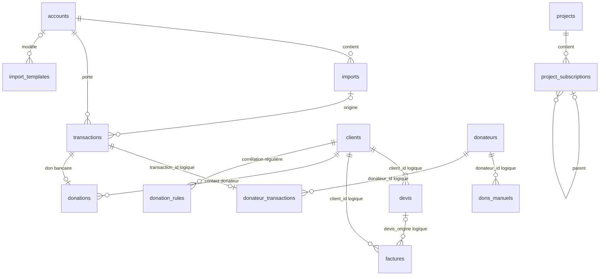
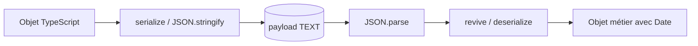

# Schéma SQLite v15

## Cycle de vie

Une base est ouverte par `Db.openForProfile(profileId)` dans
`data/profils/{profileId}/comptal.db`. L’ouverture applique :

```sql
PRAGMA foreign_keys = ON;
PRAGMA journal_mode = WAL;
PRAGMA busy_timeout = 10000;
```

`ensureSchema()` crée toutes les tables manquantes, ajoute les colonnes prévisionnelles absentes et
crée les index. `migrate()` positionne ensuite `PRAGMA user_version = 15`.

## Vue relationnelle



Seules les relations déclarées `REFERENCES` sont imposées par SQLite. Les relations qualifiées
« logique » sont maintenues par les services.

## Comptabilité

### `accounts`

| Colonne | Type/contrainte | Usage |
|---|---|---|
| `id` | INTEGER PK auto | Identifiant interne |
| `code` | TEXT UNIQUE NOT NULL | Code affiché et importé |
| `name` | TEXT NOT NULL | Libellé |
| `color` | TEXT NOT NULL | Couleur des graphiques |
| `initial_balance` | REAL NOT NULL | Base des soldes cumulés |
| `created_at` | TEXT | Horodatage SQLite |

### `categories`

`id`, `code` unique, `name`, `color`, `created_at`, `group_id` optionnel vers `category_groups`.
Les transactions conservent `category_code` sans FK afin de tolérer une valeur importée.
`ConfigService` propage explicitement un changement de code vers `transactions` et `autocat_stats`.

Les codes `X` et `Y` ont une sémantique de filtrage spéciale dans les statistiques.

### `imports`

Historique d’un lot : fichier, compte, bornes de date, nombre de lignes et date d’import.
`account_id` est supprimé en cascade avec le compte.

### `transactions`

| Colonne | Invariant |
|---|---|
| `account_id` | FK obligatoire vers `accounts` |
| `date` | Texte ISO `yyyy-MM-dd` obligatoire |
| `value_date` | Date ISO optionnelle |
| `debit` | Réel normalement inférieur ou égal à zéro |
| `credit` | Réel normalement supérieur ou égal à zéro |
| `label` | Libellé, chaîne vide autorisée |
| `category_code` | Code optionnel, sans FK |
| `import_id` | FK optionnelle, devient `NULL` si l’import est supprimé |
| `updated_at` | Renseigné lors d’une édition |
| `deleted_at` | Soft-delete (v15) : ISO/datetime SQLite si la ligne est archivée. Les listes, stats et l’export ignorent ces lignes (`sqlTxActive`). Ctrl+Z remet `deleted_at` à NULL. |

Index : `(account_id, date)`, `date`, `category_code`.

### `autocat_stats`

Clé composée `(word, category_code)` et compteur d’apprentissage. Le service extrait les mots des
libellés catégorisés et utilise les fréquences pour suggérer une catégorie.

### `import_templates`

Nom, compte optionnel, solde initial optionnel et `column_roles_json`. Le JSON associe le nom d’une
colonne à un rôle (`date`, `valueDate`, `label`, `debit`, `credit`, `debitCredit`, catégorie).

## Prévisionnel

### `projects`

Identité, dates, solde initial, dates techniques et `widget_layout` JSON. Le layout contient
granularité, ratio du split, colonnes visibles, largeurs et widgets.

### `project_subscriptions`

Chaque ligne contient type, montant, périodicité, dates, catégorie, couleur et ordre.
`project_id` est une FK avec suppression en cascade. `parent_id` construit les groupes mais n’est
pas déclaré FK. `is_group=1` distingue un groupe d’une ligne calculée.

## Organisation et PDF

| Table | Clé | Payload |
|---|---|---|
| `invoice_emetteur` | singleton `id=1` | `EmetteurExtended` |
| `invoice_settings` | singleton `id=1` | Numérotation, TVA et conditions |
| `pdf_templates` | identifiant texte | Mise en page, polices, couleurs et marges |
| `legal_mentions` | identifiant texte | Type, catégorie, contenu et activation |
| `secteurs_activite` | identifiant texte | Nom et ordre |

## Contacts et facturation

### `clients`

Colonnes indexables (`id`, `code_client`, `type`, `archived`, `updated_at`) et payload `Client`.

### `contact_groups`

Identifiant, payload `ContactGroupe` et `updated_at`.

### `devis`

Identifiant, `client_id`, numéro, statut, indicateur historique `supprime`, payload complet et date
de mise à jour. Un devis caduc reste présent avec sa signature dans le payload.

### `factures`

Même structure, complétée par `devis_origine`. Les paiements sont un tableau dans le payload de la
facture. Les index accélèrent recherches par client et numéro.

### `postes_catalogue` et `postes_groupes`

Le champ `kind` sépare `facturation` et `association`. Le payload contient respectivement un poste
matériel/travail ou un groupe de postes.

## Association

| Table | Contenu |
|---|---|
| `association_config` | Singleton `AssociationConfig` |
| `donateurs` | Payload `Donateur` et date de mise à jour |
| `donateur_transactions` | Une transaction liée à au plus un donateur |
| `dons_manuels` | Don hors transaction bancaire |
| `registre_recus` | Reçus émis et annulations |

### `donations` (v9)

Journal unifié des dons. `source` distingue une saisie manuelle d’une transaction bancaire ;
`transaction_id` est unique. `anonymous=1` impose `contact_id=NULL` et désactive le reçu nominatif.
`nature` distingue numéraire, nature et mécénat de compétences. Les champs de valorisation
conservent la méthode et l’indication que le montant a été communiqué par le donateur.

### `donation_rules` (v9)

Règles de corrélation des transactions créditrices par fragment de libellé et catégorie optionnelle.
Elles ciblent un contact portant le rôle `donateur`.

## Registre documentaire

| Table | Contenu |
|---|---|
| `register_settings` | Numérotation et format PDF du registre, singleton par profil |
| `register_documents` | Métadonnées, période, instantané JSON immuable et chemin du PDF généré |
| `register_items` | Éléments libres ajoutés à un document |
| `register_links` | Informations et références liées à un document |
| `register_attachments` | Pièces jointes globales ou rattachées à un document |

### `color_palettes` / `label_rules` / `dashboard_settings` / `app_settings` / `category_groups`

Réglages persistés par profil (v10–v14) : palettes personnalisées, libellés routiniers, widgets du
Dashboard, onglets Finance, regroupements de catégories.

### `plugin_state` (v15)

Activation **par profil** des mods globaux `data/plugins/{id}/`.

| Colonne | Usage |
|---|---|
| `plugin_id` | PK, identifiant du `manifest.json` |
| `enabled` | 0/1 |
| `applied_at` | ISO de la dernière application (packs catégories / mentions / import) |

## Payloads JSON

Les objets avec des propriétés `Date` sont enregistrés en chaînes ISO. Au chargement, les services
utilisent `parseDateOrNow()` et les fonctions `revive`/`deserialize`. Un outil qui insère directement
des données doit respecter les noms camelCase des types TypeScript, même si les colonnes d’index
sont en snake_case.



## Matrice tables → services

| Tables | Service principal |
|---|---|
| `accounts`, `categories` | `ConfigService` |
| `imports`, `transactions` | `ImportService`, `EditionService`, `StatsService` |
| `autocat_stats` | `AutoCategorisationService` |
| `import_templates` | `ImportTemplateService` |
| `projects`, `project_subscriptions` | `ProjectService` |
| `clients` | `ClientService` |
| `contact_groups` | `ContactGroupService` |
| `devis`, `factures` | `InvoiceService`, `PaymentTrackingService` |
| `invoice_emetteur`, `invoice_settings` | `EmetteurService` |
| `pdf_templates`, `legal_mentions` | services PDF/mentions |
| `postes_catalogue`, `postes_groupes` | `PosteService` |
| `association_config` | `AssociationConfigService` |
| `donateurs`, `donateur_transactions`, `dons_manuels` | Compatibilité et migration Comptal2 |
| `donations`, `donation_rules` | `DonationService` |
| `registre_recus` | `RegistreRecusService` |
| `register_*` | `RegisterService`, `RegisterPDFService` |
| `color_palettes` | `PaletteService` |
| `label_rules` | `LabelRuleService` |
| `dashboard_settings` | `DashboardSettingsService` |
| `app_settings` | `FinanceSettingsService` (et réglages profil) |
| `category_groups` | `ConfigService` |
| `plugin_state` | `PluginService` |
