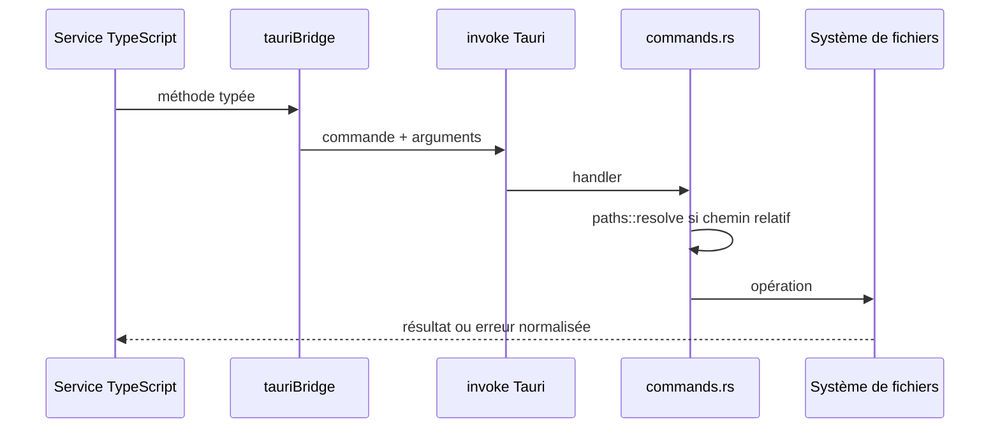
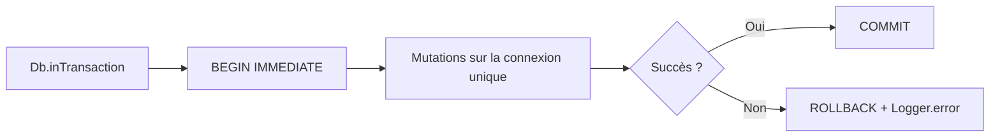

# Services transverses et infrastructure

## `tauriBridge`

`src/services/tauri.ts` traduit les appels TypeScript en commandes `invoke` Rust. Les opérations
relatives utilisent la racine `data/`; les opérations externes acceptent uniquement un chemin
obtenu par une action explicite.

## `jsonStore`

`src/services/jsonStore.ts` centralise le stockage des objets JSON en SQLite :

| Fonction | Contrat |
|---|---|
| `loadSingletonJson<T>` | Charge le payload de `id=1` |
| `saveSingletonJson` | UPSERT du singleton |
| `loadAllJson<T>` | Parse toutes les lignes `{id, payload}` |
| `upsertJsonRow` | UPSERT générique ou SQL spécialisé |
| `deleteJsonRow` | Suppression par identifiant |
| `replaceAllJson` | Remplacement complet d’une table |

Les noms de table sont fournis par les services internes et ne doivent jamais provenir d’une saisie
utilisateur.

## Journalisation

`Logger.init()` récupère les informations de session avant tout autre service. `withLog()` encadre
les opérations significatives avec événements start/end/error. `Db.select()` ajoute une mesure
`perf` au-delà de 100 ms et `Db.execute()` journalise le nombre de lignes modifiées.

| Flux | Fichier |
|---|---|
| Application | `{session}_(app).jsonl` |
| Erreurs | `{session}_(error).jsonl` |
| Données | `{session}_(data).jsonl` |
| Performance | `{session}_(perf).jsonl` |

## SQLite mono-connexion

Le patch `src-tauri/patches/tauri-plugin-sql` configure le pool à une connexion. Sans cette
contrainte, `BEGIN`, mutations et `COMMIT` pourraient emprunter des connexions différentes et
provoquer un verrouillage.

Une modification du patch Rust nécessite un redémarrage Tauri complet.

## Préférences Édition

`EditionUiService` lit et écrit
`data/profils/{profileId}/parametre/edition_ui.json`. Les largeurs sont donc propres au profil sans
alourdir le schéma comptable. `useEditionHistory` reste en mémoire et n’est pas restauré au
redémarrage.

## Réseau externe

L’application n’a pas de backend. Les sorties réseau connues sont :

- `SireneAPIService` vers `recherche-entreprises.api.gouv.fr` pour rechercher une entreprise ;
- le plugin updater vers la release GitHub configurée ;
- le serveur Vite local en développement.

`SireneAPIService` normalise la réponse distante avant de préremplir les formulaires. Une panne
réseau ne doit pas empêcher la saisie manuelle.

## Graphiques

`utils/registerCharts.ts` enregistre les composants Chart.js communs. Les pages transforment les
résultats SQL en labels/séries ; `periodKeys.ts` garantit le tri et les libellés cohérents entre
Dashboard, Finance et Prévisionnel.

## Mises à jour

`UpdateService.checkForUpdate()` interroge le plugin updater vers
`https://github.com/LeopaulV/Comptal2/releases/latest/download/latest.json`.
`downloadInstallAndRelaunch()` télécharge, installe, remonte la progression puis demande la relance
via `tauri-plugin-process`. En production, `UpdateNotifier` lance cette vérification au démarrage.
L’installeur NSIS remplace le programme sous `%LOCALAPPDATA%\Comptal2.1` ; les profils restent dans
`%APPDATA%\com.leopaul.comptal21\data`.
